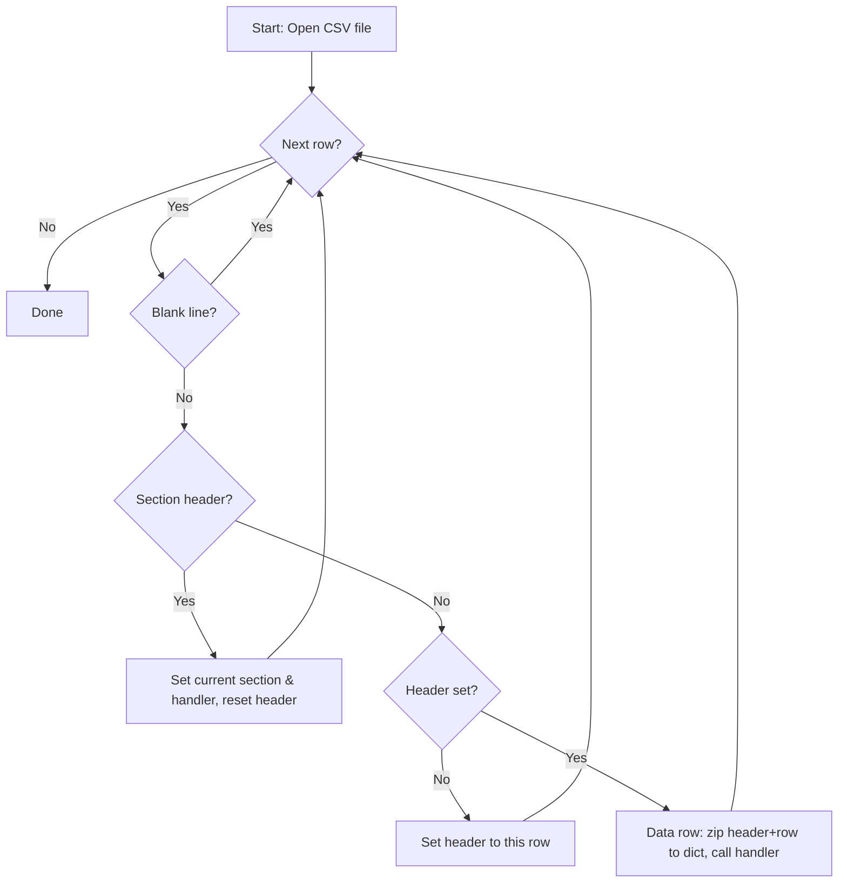
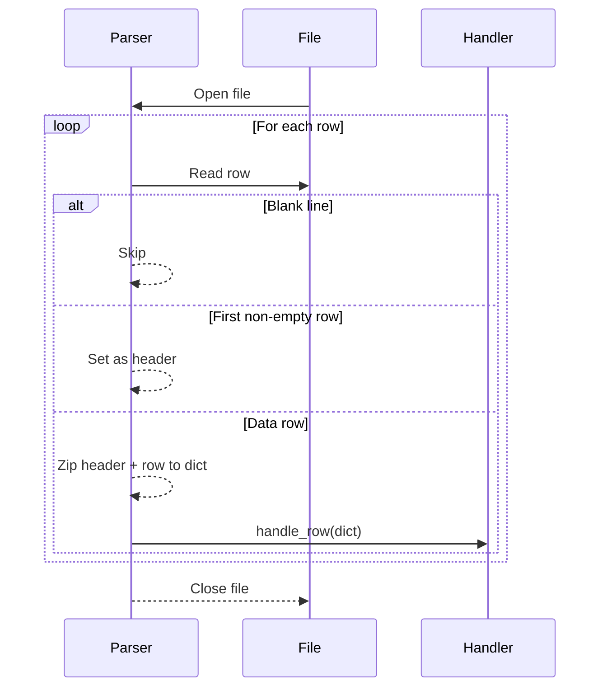

# BaseCSVParser Module

This document describes the design and flow of the `BaseCSVParser` in the `core/csv` module. This parser provides a flexible, extensible foundation for parsing both single-section and multi-section CSV files, supporting custom section handlers, error handling, and normalization.

## Overview
- Handles both simple (single-section) and complex (multi-section) CSVs
- Uses pluggable section handlers for each section or for the whole file
- Supports strict and lenient error handling modes
- Designed for extensibility and testability

## Main Parsing Loop Flow



## Usage
- Register section handlers for each section (or use `None` for single-section files)
- Subclass `CsvSectionHandler` and implement `handle_row(row: dict)` for your logic
- The parser will call your handler with each row as a dictionary


## Sequence Diagram: Single-Section (No Sections) CSV

This diagram shows how the parser processes a CSV with just a header and data rows:



In this mode, register your handler with the key `None` in `section_handlers`.


## Testing

Test data is stored in `tests/test_data/` and follows a descriptive naming convention (see `tests/README.md`).

- `simple.csv`: Minimal valid single-section CSV
- `multisection.csv`: Multi-section CSV with headers and data
- `malformed.csv`: CSV with missing fields, bad types, or malformed rows
- `edgecase.csv`: CSV with edge cases (empty, negative, zero, large values)

Tests are written using `pytest` in `tests/test_base_csv_parser.py` and cover:
- Single-section parsing
- Multi-section parsing
- Error handling (strict/lenient)
- Edge cases

To run all tests:

```sh
pytest
```

Add new test files and cases as new formats or edge cases are encountered.
