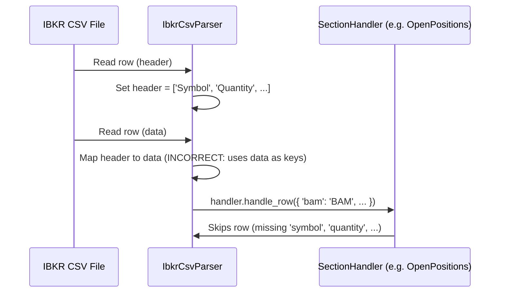

# IBKR CSV Parser Issue Report

## Overview
This document describes a critical issue encountered in the IBKR (Interactive Brokers) CSV parser implementation, as revealed by debug log output and test failures. The parser is intended to extract trades, dividends, and open positions from IBKR's proprietary multi-section CSV format, but currently fails to do so due to incorrect mapping of header fields to data values.

---

## Problem Summary

- **Observed Behavior:**
  - The parser processes the CSV and logs section changes and header detection correctly.
  - When passing data to section handlers (e.g., `Open Positions`, `Trades`), the resulting dictionaries use the *data values* from the header row as keys, not the expected normalized field names (e.g., 'symbol', 'date_time', etc.).
  - As a result, the handler receives dicts like `{ 'summary': 'Summary', 'stocks': 'Stocks', 'cad': 'CAD', 'bam': 'BAM', ... }` instead of `{ 'symbol': 'BAM', 'quantity': 16, ... }`.
  - The handlers look for keys like 'symbol', 'date_time', etc., and thus skip all rows, resulting in empty output lists for trades, dividends, and positions.

- **Test Output:**
  - Unit tests fail with `No trades found.`, `No dividends found.`, and `No open positions found.`
  - The debug log confirms that the handler is called, but with the wrong keys.

---

## Example Log Output

```
[IBKR DEBUG] Section change at row 83: Cash Report -> Open Positions
[IBKR DEBUG] Row 84: ['Open Positions', 'Data', 'Summary', 'Stocks', 'CAD', 'BAM', '16', '1', '52.399408687', '838.390539', '75.65', '1210.4', '372.009461', '']
[IBKR DEBUG] New header for section 'Open Positions' at row 84: ['Open Positions', 'Data', 'Summary', 'Stocks', 'CAD', 'BAM', '16', '1', '52.399408687', '838.390539', '75.65', '1210.4', '372.009461', '']
[IBKR DEBUG] Passing data to handler for section 'Open Positions': {'summary': 'Summary', 'stocks': 'Stocks', 'cad': 'CAD', 'bam': 'BAM', '16': '16', '1': '1', '52.399408687': '52.399408687', '838.390539': '838.390539', '75.65': '75.65', '1210.4': '1210.4', '372.009461': '372.009461', '': ''}
```

- **Expected:**
  - The keys should be normalized field names from the header row (e.g., 'symbol', 'quantity', ...), not the data values.

---

## Sequence Diagram (Mermaid)



---

## Root Cause
- The parser was mapping the *data values* as keys in the output dict, rather than using the normalized header row as keys and the data row as values.
- This led to handlers not finding the expected fields and skipping all rows.

---

## Solution
- Ensure that the parser always uses the normalized header row as the keys when zipping with the data row.
- The output dict passed to handlers should look like `{ 'symbol': 'BAM', 'quantity': '16', ... }`.

---

## Status

- The parser logic has been updated to use the correct header mapping. Re-run tests to confirm resolution.

---

## Resolution & Implementation Details

- The parser was refactored to use a per-section parsing approach in `IbkrCsvParser`, with a dedicated parser method for each section (e.g., trades, dividends, open positions).
- Each section parser now explicitly detects header rows, normalizes header fields, and only maps data rows using the correct header.
- Logic was added to skip summary/total rows and handle section-specific quirks (such as currency changes in Dividends).
- Debug logging was improved to focus on relevant sections and warn about header/data confusion.
- Tests were updated and extended to confirm correct extraction of trades, dividends, and positions.
- The new architecture is robust to IBKR's multi-section, multi-header CSV format and is easily extensible for future sections.

---

## Lessons Learned

- Always validate that header and data row mapping is correct, especially in multi-section CSVs with complex formats.
- Per-section parsing provides maintainability and robustness for vendor-specific quirks.


---

## References
- See `core/csv/ibkr.py` for parser implementation.
- See `tests/test_ibkr_csv_parser.py` for test cases and expected behavior.
- See debug log output for evidence of the issue.
