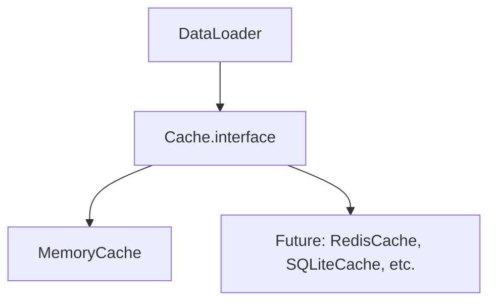

# Cache Module Design

This document outlines the design for a modular cache system to be used with the DataLoader and other components. The cache module will provide a unified interface for caching, with pluggable backends (starting with an in-memory implementation) and support for future persistent or distributed backends (e.g., Redis, SQLite).

## Goals
- Provide a simple, type-safe cache interface for use by DataLoader and other modules
- Support pluggable backends via subclassing
- Ensure thread/process safety where appropriate
- Allow for TTL (time-to-live) and cache invalidation strategies
- Enable easy extension to persistent/distributed backends

## Architecture Overview



## Interface

The cache module will define an abstract base class `CacheBackend` with the following methods:

```python
from typing import Any, Optional

class CacheBackend:
    def get(self, key: Any) -> Optional[Any]:
        """Retrieve a value from the cache by key. Returns None if not found or expired."""
        raise NotImplementedError

    def set(self, key: Any, value: Any, ttl: Optional[float] = None) -> None:
        """Store a value in the cache with an optional time-to-live (ttl) in seconds."""
        raise NotImplementedError

    def delete(self, key: Any) -> None:
        """Remove a value from the cache by key."""
        raise NotImplementedError

    def clear(self) -> None:
        """Clear all entries from the cache."""
        raise NotImplementedError
```

- All cache backends must implement this interface.
- The interface is intentionally minimal to support a wide range of backends.
- TTL support is optional for backends that do not natively support it.

## MemoryCache Implementation

The first backend will be an in-memory cache, suitable for single-process use and testing. It will support optional TTL for each entry.

### Example Implementation Outline

```python
import time
from typing import Any, Optional, Dict, Tuple

class MemoryCache(CacheBackend):
    def __init__(self):
        self._store: Dict[Any, Tuple[Any, Optional[float]]] = {}

    def get(self, key: Any) -> Optional[Any]:
        entry = self._store.get(key)
        if entry is None:
            return None
        value, expires_at = entry
        if expires_at is not None and expires_at < time.time():
            self.delete(key)
            return None
        return value

    def set(self, key: Any, value: Any, ttl: Optional[float] = None) -> None:
        expires_at = time.time() + ttl if ttl is not None else None
        self._store[key] = (value, expires_at)

    def delete(self, key: Any) -> None:
        self._store.pop(key, None)

    def clear(self) -> None:
        self._store.clear()
```

- The in-memory cache uses a dictionary to store values and expiration times.
- Expired entries are removed on access.
- This backend is not safe for multi-process or distributed use, but is thread-safe for CPython's GIL use cases.

## Integration with DataLoader

- DataLoader will accept a `CacheBackend` instance as its backend argument.
- The cache interface is intentionally similar to the one already used in DataLoader, so migration will be straightforward.
- Persistent/distributed backends can be added later by subclassing `CacheBackend`.

## Future Extensions
- Add RedisCache, SQLiteCache, or other persistent/distributed backends
- Add pub/sub or event-based invalidation for distributed cache coherence
- Add metrics and logging hooks for cache usage and performance

---
Update this document as the cache module evolves or new backends are added.
