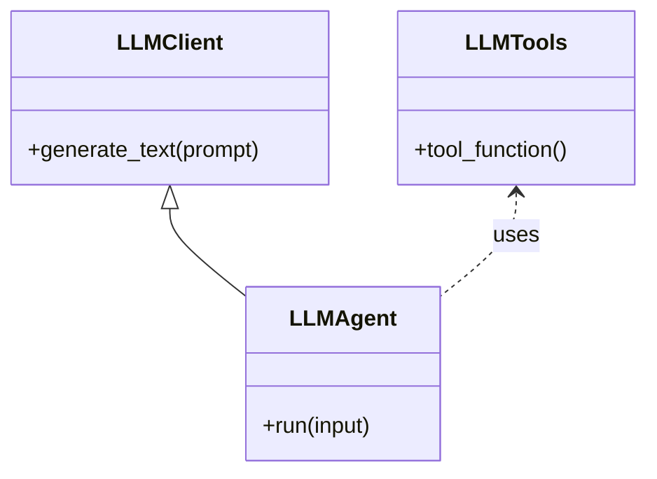

# Core LLM Agent Module

This document describes the architecture and design of the core LLM agent module, which provides a minimal, stable foundation for LLM-powered features in the portfolio tracker.

---

## Goals

- Provide a bare-bones, reusable LLM agent and tool registry.
- Enable domain modules to extend LLM capabilities without modifying core.
- Ensure maintainability and testability via clear interfaces and DI.
- Keep the core LLM module stable; domain consumers should extend, not modify, core.

---

## Directory Structure

```plaintext
core/
  integrations/
    llm/
      llm_tools.py
      llm_agent.py
      llm_interface.py
      llm_prompt.txt
```

---

## Mermaid Diagram



---

## Key Components

### llm_interface.py

Defines the abstract base class for LLM clients/agents.

```python
from abc import ABC, abstractmethod

class LLMClient(ABC):
    @abstractmethod
    def generate_text(self, prompt: str, **kwargs) -> str:
        pass
```

---

### llm_tools.py

Defines and registers generic, reusable LLM tools. No domain logic should be included here.

```python
from langchain.tools import tool

@tool
def generic_tool():
    """A generic tool for demonstration purposes."""
    return "This is a generic tool."
```

---

### llm_agent.py

Minimal agent setup and tool integration. Uses the interface and tools defined above.

```python
from langchain_openai import ChatOpenAI
from langchain.agents import initialize_agent, AgentType
from .llm_tools import generic_tool
from .llm_interface import LLMClient

class LLMAgent(LLMClient):
    def __init__(self, api_key: str, prompt: str):
        self.llm = ChatOpenAI(openai_api_key=api_key)
        self.agent = initialize_agent(
            [generic_tool],
            self.llm,
            agent=AgentType.ZERO_SHOT_REACT_DESCRIPTION,
            verbose=True,
            prompt=prompt,
        )

    def generate_text(self, prompt: str, **kwargs) -> str:
        return self.agent.run(prompt)
```

---

### llm_prompt.txt

A straightforward, generic prompt describing the LLM's role as a stock portfolio tracker and investor advisor.  
Example contents:

```
You are an AI assistant for a stock portfolio tracker and investor advisor. Answer questions, summarize portfolio performance, and provide insights using clear, concise language.
```

---

## LLM Integration Dependencies

The core LLM integration relies on a minimal set of dependencies to provide agent, tool, and prompt abstractions. These dependencies are required only for LLM-powered features and can be installed independently from the rest of the application.

### Required Packages

- **langchain**: Framework for building LLM-powered applications, including agent and tool abstractions.
- **langchain-openai**: LangChain integration for OpenAI LLMs (e.g., GPT-3.5, GPT-4).
- **openai**: Official OpenAI Python client for direct API access.

### Installation

To install the LLM integration dependencies, run:

```zsh
pip install langchain langchain-openai openai
```

> These packages should be listed in your `requirements.txt` if you plan to use or extend LLM features.

---

## Extension Pattern

- Domain modules should subclass `LLMAgent`, add domain-specific tools, and override the prompt as needed.
- Core should remain unchanged for most updates.
- Prompts and tools in core are generic; domain-specific logic lives in domain modules.

---

## Summary of Discussion

- The core LLM module is intentionally minimal and stable.
- All domain-specific logic, prompts, and tool extensions should live in domain modules, not in core.
- The core LLM agent and tools are designed for extension, not modification.
- Dependency injection and separation of concerns are strictly followed.

---

Update this document as the LLM agent module evolves.
