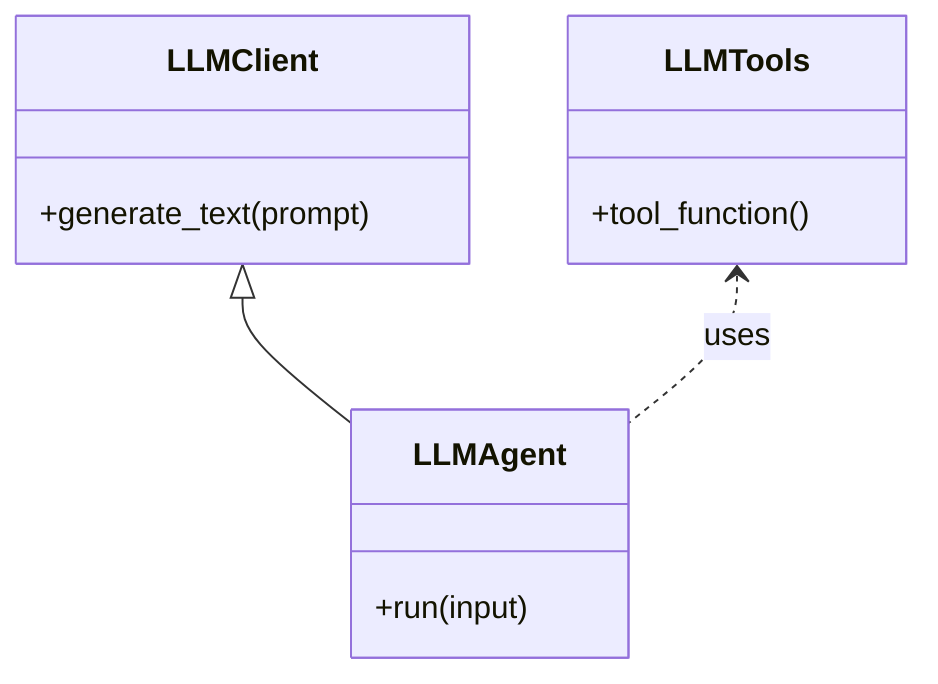

# Core LLM Agent Module

This document describes the architecture and design of the core LLM agent module, which provides a minimal, stable foundation for LLM-powered features in the portfolio tracker.

---

## Goals

- Provide a bare-bones, reusable LLM agent and tool registry.
- Enable domain modules to extend LLM capabilities without modifying core.
- Ensure maintainability and testability via clear interfaces and DI.
- Keep the core LLM module stable; domain consumers should extend, not modify, core.

---

## Directory Structure

```plaintext
core/
  integrations/
    llm/
      llm_tools.py
      llm_agent.py
      llm_interface.py
      llm_prompt.txt
```

---

## Mermaid Diagram



---

## Key Components


### llm_interface.py

Defines the abstract base class for LLM clients/agents, now focused on LangGraph workflows.

```python
from abc import ABC, abstractmethod

class LLMClient(ABC):
    @abstractmethod
    def summarize_positions(self, positions: list) -> str:
        pass
```

---


### llm_tools.py

Defines generic, reusable LLM tools as plain Python functions for use in LangGraph workflows.

```python
def summarize_positions_tool(positions: list) -> str:
    """Format or summarize positions for the LLM."""
    return "\n".join(str(position) for position in positions)
```

---


### llm_agent.py

Defines the LLM agent using LangGraph for stateful, multi-step workflows.

```python
from langgraph.graph import StateGraph, END
from langchain_openai import ChatOpenAI
from .llm_tools import summarize_positions_tool
from .llm_interface import LLMClient

class LLMAgent(LLMClient):
    def __init__(self, api_key: str):
        self.llm = ChatOpenAI(openai_api_key=api_key)
        self.graph = self._build_graph()

    def _build_graph(self):
        def llm_summary_node(state):
            positions = state["positions"]
            summary_input = summarize_positions_tool(positions)
            prompt = f"""
Below are my Interactive Brokers positions from my portfolio activity report. Please summarize my positions and provide feedback.

Positions:
{summary_input}
"""
            response = self.llm.invoke(prompt)
            return {"llm_response": response.content if hasattr(response, "content") else str(response)}

        graph = StateGraph()
        graph.add_node("summarize", llm_summary_node)
        graph.set_entry_point("summarize")
        graph.add_edge("summarize", END)
        return graph.compile()

    def summarize_positions(self, positions: list) -> str:
        result = self.graph.invoke({"positions": positions})
        return result["llm_response"]
```

---

### llm_prompt.txt

A straightforward, generic prompt describing the LLM's role as a stock portfolio tracker and investor advisor.  
Example contents:

```
You are an AI assistant for a stock portfolio tracker and investor advisor. Answer questions, summarize portfolio performance, and provide insights using clear, concise language.
```

---

## LLM Integration Dependencies

The core LLM integration relies on a minimal set of dependencies to provide agent, tool, and prompt abstractions. These dependencies are required only for LLM-powered features and can be installed independently from the rest of the application.

### Required Packages

- **langchain**: Framework for building LLM-powered applications, including agent and tool abstractions.
- **langchain-openai**: LangChain integration for OpenAI LLMs (e.g., GPT-3.5, GPT-4).
- **openai**: Official OpenAI Python client for direct API access.

### Installation

To install the LLM integration dependencies, run:

```zsh
pip install langchain langchain-openai openai
```

> These packages should be listed in your `requirements.txt` if you plan to use or extend LLM features.

---

## Extension Pattern

- Domain modules should subclass `LLMAgent`, add domain-specific tools, and override the prompt as needed.
- Core should remain unchanged for most updates.
- Prompts and tools in core are generic; domain-specific logic lives in domain modules.

---

## Summary of Discussion

- The core LLM module is intentionally minimal and stable.
- All domain-specific logic, prompts, and tool extensions should live in domain modules, not in core.
- The core LLM agent and tools are designed for extension, not modification.
- Dependency injection and separation of concerns are strictly followed.

---


## Migration to LangGraph

All core LLM agent and tool orchestration is now implemented using LangGraph. This provides a more flexible, maintainable, and stateful workflow engine for LLM-powered applications, supporting multi-step reasoning, tool use, and complex branching logic.

> For more details, see the [LangGraph documentation](https://python.langchain.com/docs/langgraph/).

Update this document as the LLM agent module evolves.
