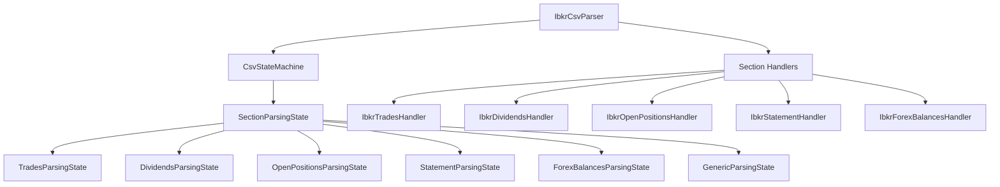

# CSV State Machine Architecture

## Overview

The CSV State Machine provides a clean, modular approach to parsing multi-section CSV files like IBKR activity reports. Each section (Trades, Dividends, Open Positions, etc.) is handled by a dedicated parsing state that encapsulates section-specific logic.

## Architecture

### State Machine Components



### Key Classes

#### `CsvStateMachine`
- Manages transitions between different section parsing states
- Delegates row processing to the current state
- Handles unknown sections with a generic parsing state

#### `SectionParsingState` (Abstract Base Class)
- Defines the interface for section-specific parsing logic
- Handles header detection and normalization
- Manages data row processing and validation
- Implements summary row skipping logic

#### Concrete Parsing States
- **`TradesParsingState`**: Handles trade data with subtotal/total row skipping
- **`DividendsParsingState`**: Processes dividend information with total row skipping
- **`OpenPositionsParsingState`**: Manages position data with summary row handling
- **`StatementParsingState`**: Special handling for statement metadata (different CSV structure)
- **`ForexBalancesParsingState`**: Processes foreign exchange balance data
- **`GenericParsingState`**: Fallback for unknown section types

## Benefits

### 1. **Modularity**
Each section's parsing logic is encapsulated in its own state class, making the code easier to understand and maintain.

### 2. **Extensibility**
Adding support for new CSV sections only requires:
- Creating a new parsing state class
- Adding it to the state machine's state registry
- No changes to existing parsing logic

### 3. **Testability**
Each parsing state can be tested independently, improving test coverage and reliability.

### 4. **Maintainability**
Changes to section-specific logic are isolated to individual state classes, reducing the risk of introducing bugs in other sections.

### 5. **Consistency**
All sections follow the same parsing pattern while allowing for section-specific customizations.

## Usage

### Basic Usage

```python
from core.csv.ibkr import IbkrCsvParser

# Create parser instance
parser = IbkrCsvParser(logger=your_logger)

# Parse CSV file
result = parser.parse("activity_report.csv")

# Access parsed data
trades = result.trades
dividends = result.dividends
positions = result.positions
metadata = result.meta
```

### State Machine Integration

The state machine is automatically integrated into the IBKR parser. Each `_parse_section_*` method now:

1. Transitions to the appropriate parsing state
2. Delegates row processing to the state machine
3. Handles any post-processing (e.g., metadata enhancement)

```python
def _parse_section_trades(self, rows, handler):
    self.state_machine.transition_to_section(SectionNames.TRADES.value)
    self.state_machine.process_section(rows, handler)
```

### Custom Section Handlers

To add support for a new section:

1. **Create a parsing state:**
```python
class NewSectionParsingState(SectionParsingState):
    def should_skip_row(self, row: List[str]) -> bool:
        # Define custom logic for skipping summary rows
        return is_summary_row(row, summary_keywords=["total"])
```

2. **Register the state:**
```python
machine = CsvStateMachine(logger)
machine.states["New Section"] = NewSectionParsingState("New Section", logger)
```

3. **Create a section handler:**
```python
class NewSectionHandler(CsvSectionHandler):
    def __init__(self):
        self.data = []
    
    def handle_row(self, row: dict):
        # Process the normalized row data
        self.data.append(row)
```

## Error Handling

The state machine provides robust error handling:

- **Missing Headers**: Warns when data rows are encountered before headers
- **Length Mismatches**: Handles cases where data row length doesn't match header length
- **Unknown Sections**: Falls back to generic parsing for unrecognized sections
- **Invalid Data**: Logs warnings for malformed rows without stopping parsing

## Testing

The state machine architecture improves testability:

### Unit Tests
- Test individual parsing states in isolation
- Verify state transitions and error handling
- Test summary row detection logic

### Integration Tests
- Test full CSV parsing with real data
- Verify data integrity across sections
- Test error recovery scenarios

### Example Test Structure
```python
def test_trades_parsing_state():
    state = TradesParsingState("Trades", logger)
    handler = Mock()
    
    # Test header processing
    header_row = ["Trades", "Header", "Symbol", "Quantity"]
    state.process_header(header_row)
    
    # Test data processing
    data_row = ["Trades", "Data", "AAPL", "100"]
    state.process_data_row(data_row, handler)
    
    # Verify handler was called with normalized data
    handler.handle_row.assert_called_with({"symbol": "AAPL", "quantity": "100"})
```

## Migration from Legacy Code

The refactoring maintains backward compatibility:

- All public APIs remain unchanged
- Existing section handlers continue to work
- Parser behavior is preserved
- Performance characteristics are maintained

### Key Changes
- `_parse_section_common` logic moved to `SectionParsingState`
- Individual parsing methods simplified to use state machine
- Improved error handling and logging
- Better separation of concerns

## Performance Considerations

The state machine introduces minimal overhead:
- State transitions are O(1) dictionary lookups
- Row processing logic is unchanged
- Memory usage is similar to the original implementation
- Parsing speed is maintained or improved due to better code organization
