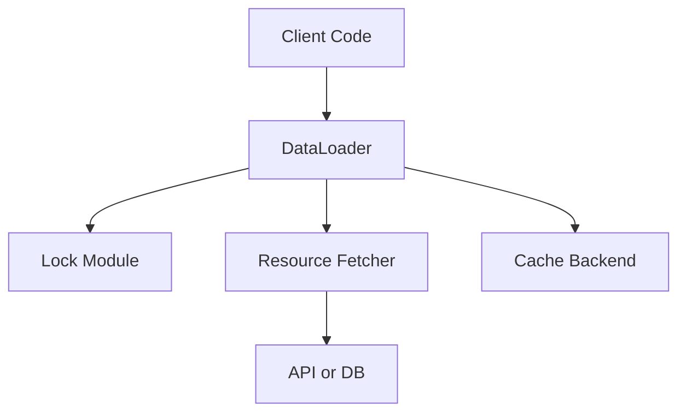

# DataLoader Module Design

This document outlines the design for a reusable DataLoader module in Python, inspired by Facebook's DataLoader pattern. The module is intended to deduplicate and batch resource fetches, with support for both in-memory and persistent backends (e.g., SQLite, Redis).

## Overview
The DataLoader module provides a unified interface for batching and deduplicating resource fetches. It is designed to:
- Batch multiple requests for the same resource type within a short time window
- Deduplicate requests for the same key
- Optionally cache results for the duration of a request or globally
- Support pluggable backends for caching and coordination (in-memory, SQLite, Redis, etc.)
- Use the lock module for safe concurrent access

## Architecture Diagram


## Data Flow
- Client calls `DataLoader.load(key)` for one or more keys
- DataLoader batches requests and acquires a lock for the resource type
- Checks cache (in-memory or persistent)
- Fetches missing data in a single batch call to the resource fetcher (e.g., stock_api)
- Stores results in cache
- Returns results to all waiting callers

## Key Decisions
- Pluggable cache/coordination backend (in-memory, SQLite, Redis)
- Locking for safe concurrent batching
- Async and sync support (future-proofing for async APIs)
- Extensible for any resource type (not just stock_api)

## Example Usage
```python
from core.dataloader import DataLoader
from core.integrations.stock_api import fetch_stock_price

loader = DataLoader(batch_load_fn=fetch_stock_price, backend="memory")
results = loader.load_many(["AAPL", "GOOG", "DDOG"])
```


## Lock Usage

To ensure safe concurrent batching and cache access, the DataLoader uses the lock module. This prevents race conditions when multiple threads or processes attempt to batch, fetch, or cache the same resource type simultaneously.


### Example Usage in DataLoader (with Dependency Injection)
```python
class DataLoader:
    def __init__(self, batch_load_fn, backend, get_named_lock, lock_name=None):
        self._batch_load_fn = validate_batch_load_fn(batch_load_fn)
        self._backend = backend
        self._get_named_lock = get_named_lock  # Injected dependency
        self._lock = self._get_named_lock(lock_name or f"dataloader:{id(self)}")

    def load_many(self, keys):
        with self._lock:
            # Check cache for keys
            # Batch missing keys
            # Call self._batch_load_fn for missing keys
            # Store results in cache
            # Return results
            pass
```

This approach allows the lock provider (e.g., in-process, file, Redis) to be injected, supporting testability and backend flexibility. The DI container can provide the appropriate `get_named_lock` implementation at runtime.

This pattern ensures that only one batch operation for a given resource type is in progress at a time, and that cache reads/writes are atomic within the lock's context. The lock backend (in-process, file, Redis, etc.) can be swapped as needed for different deployment scenarios.

---

To ensure correct usage and predictable batching, the DataLoader enforces that the `batch_load_fn` is only callable with a single primitive argument (e.g., a list of keys, where each key is a string, int, etc.).

### How to Enforce in Python
- Use the `inspect` module to check the function signature at DataLoader initialization.
- Raise a `TypeError` if the function does not accept exactly one positional argument.
- Optionally, use type hints and runtime checks to ensure the argument is a list of primitives.

#### Example enforcement code:
```python
import inspect
from typing import Callable

def validate_batch_load_fn(fn: Callable):
    sig = inspect.signature(fn)
    params = list(sig.parameters.values())
    if len(params) != 1:
        raise TypeError("batch_load_fn must accept exactly one argument (a list of keys)")

    def wrapper(keys):
        if not isinstance(keys, list):
            raise TypeError("Argument to batch_load_fn must be a list")
        primitive_types = (str, int, float, bool)
        if not all(isinstance(k, primitive_types) for k in keys):
            raise TypeError("All keys passed to batch_load_fn must be primitive types (str, int, float, bool)")
        if keys:
            first_type = type(keys[0])
            if not all(type(k) == first_type for k in keys):
                raise TypeError("All keys passed to batch_load_fn must be of the same type")
        return fn(keys)
    return wrapper
```


This validation should be performed in the DataLoader's constructor. You can wrap the provided function with `validate_batch_load_fn` to enforce both the signature and runtime type checks:

```python
self._batch_load_fn = validate_batch_load_fn(batch_load_fn)
```


## Open Questions

### Cache Invalidation for Persistent Backends (Current Approach)

For stock data that is updated frequently but can tolerate some lag, a simple and robust approach is to use periodic fetching with a time-based cache expiry (TTL). For example, the DataLoader can fetch new data from the external API at most once every 5 minutes for each key or batch. Cached results are stored with a TTL (e.g., 5 minutes) in the persistent backend (such as Redis). Requests within the TTL window return cached data, while requests after expiry trigger a new fetch and cache update. This approach is easy to implement, reduces API calls, and provides predictable staleness bounds.

**Summary:**
- Store each cache entry with a 5-minute TTL.
- On cache miss or expiry, fetch fresh data and update the cache.
- Accept that data may be up to 5 minutes out of date.

---

## Future Plans: Pub/Sub Invalidation for Distributed Systems

For more advanced or distributed scenarios, a pub/sub-based cache invalidation mechanism can be used. When data is updated (e.g., by a background job or another service), an invalidation message is published to a channel (e.g., using Redis Pub/Sub). All DataLoader instances subscribe to this channel and, upon receiving an invalidation event, evict or refresh the relevant cache entries. This ensures that all nodes see updates promptly, even in a multi-process or multi-node deployment.

**Summary:**
- Use a pub/sub system (such as Redis Pub/Sub) to broadcast cache invalidation events.
- DataLoader instances listen for invalidation messages and update or evict their caches accordingly.
- Enables near real-time cache coherence across distributed systems.


---

## Additional Open Questions

- **Should batching be time-based, event-based, or both?**
    - What are the tradeoffs between batching on a timer (e.g., every X ms) versus batching on certain triggers (e.g., when a queue reaches a certain size)? Should both be supported for flexibility?

- **How to best support async APIs and backends?**
    - Should the DataLoader provide both sync and async interfaces? What are the best practices for integrating with async resource fetchers and caches?

---
Update this document as the DataLoader module evolves or new backends are added.
