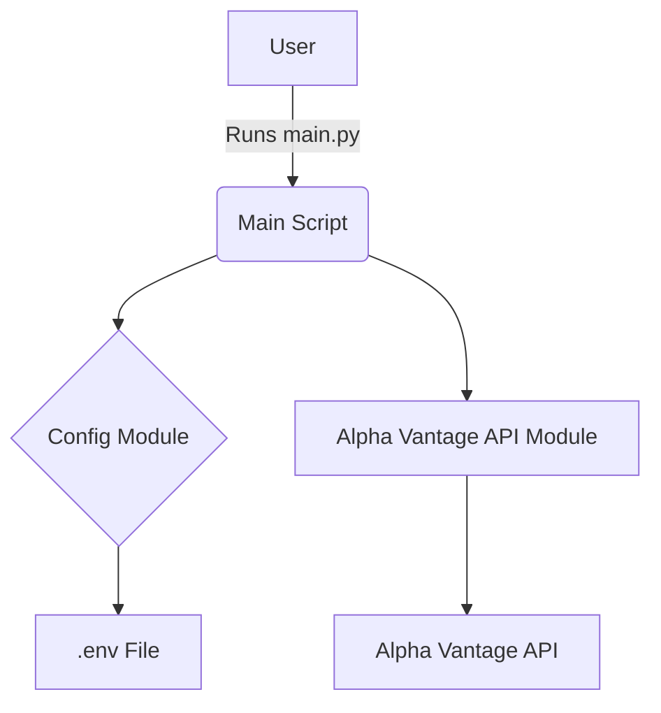

# Design Document Example

This document demonstrates how to structure design docs for easy AI consumption and collaboration.

## Overview
Describe the purpose and scope of your feature or module here.

## Architecture Diagram

## Data Flow
- User runs `main.py`
- Loads config and environment
- Fetches stock prices via Alpha Vantage API

## Key Decisions
- Centralized config loading
- Modular API integration

## Open Questions
- What other data sources should be supported?
- How should errors be reported to the user?

---

> You can add more sections as needed, and use Mermaid diagrams for flows, state, or sequence diagrams.
