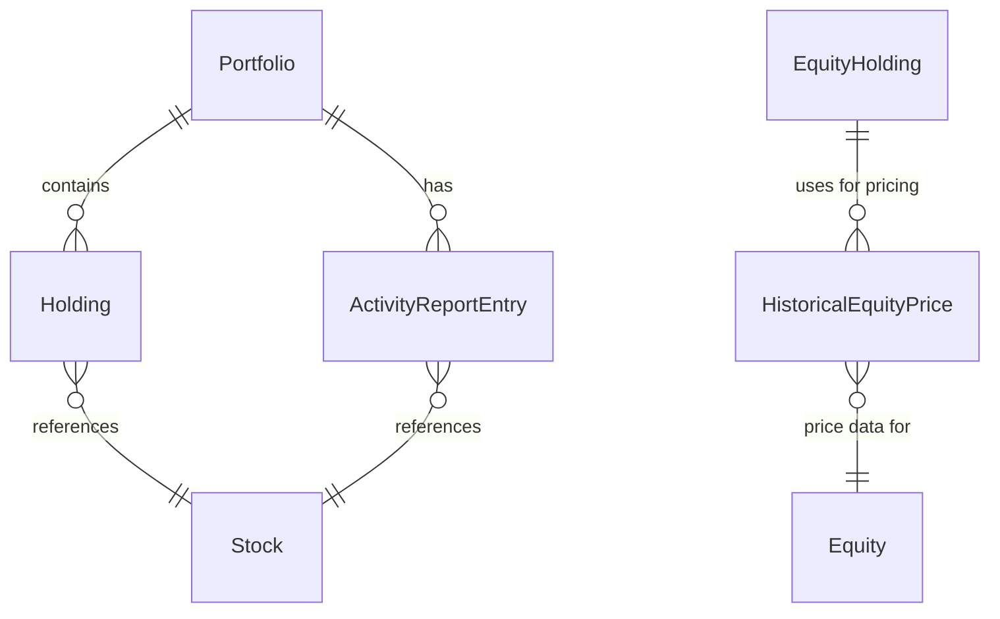

## Domain Events

Domain events capture meaningful changes in the state of the portfolio and its related entities. They are used for audit, integration, and triggering side effects.

### Common Portfolio Domain Events

- **PortfolioCreated**: A new portfolio is created.
- **PortfolioRenamed**: The portfolio's name is changed.
- **PortfolioDeleted**: The portfolio is deleted.
- **HoldingAdded**: A new holding is added to the portfolio.
- **HoldingRemoved**: A holding is removed from the portfolio.
- **HoldingUpdated**: A holding's quantity, cost basis, or other attributes are updated.
- **ActivityReportEntryAdded**: An activity report entry is added (e.g., trade, dividend, fee).
- **ActivityReportEntryRemoved**: An activity report entry is removed.
- **CashBalanceUpdated**: The cash balance of the portfolio is updated (e.g., deposit, withdrawal, dividend).
- **PortfolioRecalculated**: The portfolio is recalculated, typically after a batch update or scenario.
- **PortfolioImported**: A portfolio is imported from an external source (e.g., IBKR CSV).
- **PortfolioExported**: A portfolio is exported for reporting or backup.

### Special Cases & Notes

- Some events (e.g., PortfolioRecalculated, PortfolioImported) may be triggered by batch or automated processes, not just direct user actions.
- ActivityReportEntry events may be high-volume; consider batching or summarizing for audit/logging.
- Domain events should be immutable, auditable, and versioned for backward compatibility. They may be published to external systems for integration or analytics.

---
## Purpose
This document defines the Portfolio domain for the Portfolio Tracker application, following strict Domain Driven Design (DDD) principles. It describes the portfolio domain model, value objects, and how portfolios relate to holdings, stocks, and activity reports.

---

## Aggregate Root

The Portfolio entity is the aggregate root for the portfolio domain. All operations and invariants are enforced through the Portfolio aggregate, which coordinates access to holdings and activity entries via repositories. Large collections are always accessed on demand for scalability.

---

## Entity Relationship Diagram


---
---

## 1. Domain Model

### Entity: Portfolio
- `id: UUID`
- `tenant_id: UUID`
- `name: PortfolioName`  # Value Object
- `holdings: Reference[List[Holding]]`  # References to holdings, loaded via repository/query, not as in-memory list
- `cash_balance: Decimal`
- `activity_entries: Reference[List[ActivityReportEntry]]`  # References to activity entries, loaded via repository/query, not as in-memory list
- `created_at: datetime`
- `updated_at: datetime`

---

## Portfolio Aggregate Invariants

The following invariants are enforced by the Portfolio aggregate to ensure domain consistency and integrity:

1. **Unique Holdings per Stock**
   - A portfolio cannot have more than one holding for the same stock (`stock_id`).
   - _Enforced when adding or updating holdings._

2. **Non-negative Cash Balance**
   - The portfolio’s `cash_balance` must never be negative.
   - _Enforced on all cash-affecting operations (trades, deposits, withdrawals, dividends, fees)._

3. **Valid Portfolio Name**
   - The portfolio name must always satisfy the `PortfolioName` value object’s validation (non-empty, max length, normalized).

4. **Consistent Ownership**
   - All holdings and activity entries must reference the same `portfolio_id` as the aggregate.

5. **No Orphan Holdings or Activity Entries**
   - Holdings and activity entries must not exist without an associated portfolio.

6. **Activity Entry Amounts**
   - Each `ActivityReportEntry.amount` must be non-null and, where applicable, must be consistent with the activity type (e.g., trade amounts must match the sum of executed trades).

7. **Timestamps**
   - `created_at` must not be after `updated_at` for any entity.

8. **Immutability of Historical Activity**
   - Once an `ActivityReportEntry` is created and associated with a portfolio, it must not be mutated. Historical entries are append-only: corrections or reversals should be handled by appending new entries or marking existing ones as logically removed (soft delete), never by in-place modification. This ensures a complete and auditable activity history.


9. **Tenant Isolation**
   - All portfolios, holdings, and activity entries must belong to the same `tenant_id` (if multi-tenant).
   - This ensures strict data isolation between tenants, preventing cross-tenant data leakage or unauthorized access. All repository queries and aggregate operations must enforce tenant scoping.

10. **Valid References**
    - All referenced `stock_id` values in holdings and activity entries must correspond to existing Stock entities.
    - This guarantees referential integrity. When creating or updating holdings or activity entries, the referenced `stock_id` must be validated against the Stock repository. Invalid or missing references should result in a domain error and the operation should be rejected.

These invariants should be enforced in the Portfolio aggregate’s command methods and validated in repository operations to ensure domain consistency and integrity.


## Repository Access Patterns for Large Collections

To avoid loading large collections into memory, the Portfolio domain uses repository/query patterns for accessing related entities:
- `holdings` and `activity_entries` are not stored as in-memory lists on the Portfolio aggregate. Instead, they are accessed via repository methods (e.g., `holding_repository.find_by_portfolio_id(portfolio_id)`, `activity_report_entry_repository.find_by_portfolio_id(portfolio_id)`).
- This approach supports scalability and performance, especially for portfolios with extensive activity logs or holdings.

---

## Scalability Considerations

The Portfolio domain is designed for scalability to support large datasets and high-throughput operations:

- **On-Demand Loading**: Large collections such as holdings and activity entries are not loaded as full in-memory lists. They are accessed via repository/query interfaces that support efficient data access.
- **Pagination and Filtering**: Repository methods for activity entries and holdings should support pagination, filtering, and streaming to efficiently handle large datasets.
- **Indexing and Query Optimization**: Database tables for activity entries and holdings should be indexed on `portfolio_id` and other common query fields to optimize query performance.
- **Caching**: Frequently accessed portfolio summaries, computed values, or expensive queries can be cached using in-memory or distributed cache backends (e.g., Redis).
- **Batch Operations**: Repository interfaces should support batch operations for bulk updates and fetches to minimize database round-trips.
- **Asynchronous Processing**: For high-throughput or distributed systems, consider using asynchronous processing and background jobs for heavy computations or data imports.
- **Eventual Consistency**: For very large or distributed deployments, consider eventual consistency for derived or summary data (e.g., portfolio performance metrics).

These patterns ensure the portfolio domain remains performant and scalable as data volume and user load grow.

---

## Private/Experimental Features

Features such as time travel, hypothetical scenarios, and advanced reversibility may be implemented as private or experimental features in a separate/private fork of this repository. These are not part of the public, production-ready domain model.

---

### Entity: Holding
- `id: UUID`
- `portfolio_id: UUID`
- `stock_id: UUID`  # References Stock entity
- `quantity: Decimal`
- `cost_basis: Decimal`
- `current_value: Decimal`
- `created_at: datetime`
- `updated_at: datetime`

### Lazy Loading Historical Equity Prices
The `EquityHolding` entity supports lazy loading for historical equity prices using the DataLoader pattern. Historical prices are fetched only when explicitly requested via the `historical_prices` property. This property uses a `DataLoader` to batch and cache requests efficiently.

#### Key Features:
- **Batched Requests**: The DataLoader batches multiple requests for historical prices, reducing database queries.
- **Caching**: Once fetched, historical prices are cached within the entity and DataLoader to avoid repeated queries.
- **Request Coalescing**: Multiple requests for the same equity ID and date range are coalesced into a single database query.
- **Composite Keys**: The DataLoader uses composite keys containing `equity_id`, `start_date`, and `end_date` for precise data fetching.

#### DataLoader Key Structure:
The DataLoader expects keys in the following format:
```python
key = {
    'equity_id': UUID('...'),
    'start_date': date(2025, 6, 12),  # 30 days ago from today
    'end_date': date(2025, 7, 12)     # today
}
```

#### Example Usage:
```python
# Configure a DataLoader for historical equity prices
def batch_load_historical_prices(keys):
    # Implementation should handle batching multiple equity_id/date_range requests
    # and return results in the same order as keys
    pass

historical_price_dataloader = DataLoader(
    batch_load_fn=batch_load_historical_prices,
    backend=cache_backend,
    get_named_lock=lock_provider,
    logger=logger
)

holding = EquityHolding(
    id=UUID("..."),
    portfolio_id=UUID("..."),
    equity_id=UUID("..."),
    quantity=Decimal("10"),
    cost_basis=Decimal("100"),
    historical_price_dataloader=historical_price_dataloader
)

# Access historical prices lazily (fetches last 30 days)
historical_prices = holding.historical_prices
```

### Entity: ActivityReportEntry
- `id: UUID`
- `portfolio_id: UUID`
- `stock_id: UUID`  # Optional, may be null for cash or non-stock activities
- `activity_type: str`  # e.g., 'TRADE', 'DIVIDEND', 'FEE', etc.
- `amount: Decimal`  # Must always be non-null
- `date: datetime`
- `raw_data: dict`  # Original parsed row for audit
- `created_at: datetime`

#### Amount Consistency with Activity Type

The `amount` field must be consistent with the `activity_type`:

- For `TRADE` activities, `amount` should reflect the total value of the trade (e.g., shares * price, including sign for buy/sell).
- For `DIVIDEND` activities, `amount` should be the cash received as a dividend.
- For `FEE` or `COMMISSION` activities, `amount` should be the fee or commission charged (typically negative).
- For `DEPOSIT` or `WITHDRAWAL`, `amount` should match the cash movement.
- For other types, the meaning of `amount` should be clearly defined and documented in the integration or parser.

If the `amount` is not consistent with the `activity_type`, the entry should be considered invalid and rejected or flagged for review.

---

### Entity: HistoricalEquityPrice
- `id: UUID`
- `equity_id: UUID`  # References Equity entity
- `price: Decimal`  # Equity price at the recorded time
- `recorded_at: datetime`  # Timestamp of the price record

### Integration with TimescaleDB
To efficiently store and query historical equity prices, the Portfolio Tracker application integrates with TimescaleDB, a time-series database built on PostgreSQL. This integration supports:

- **Efficient Storage**: Historical equity prices are stored as time-series data, optimized for scalability and performance.
- **Querying**: TimescaleDB enables efficient querying of historical prices for analysis, reporting, and portfolio calculations.
- **Aggregation**: Built-in support for aggregating data over time intervals (e.g., daily, weekly, monthly averages).
- **Partitioning**: The `historical_equity_price` table is configured as a hypertable partitioned on `recorded_at` (time dimension) and `equity_id` (space dimension) with 4 space partitions. This ensures balanced data distribution and optimized query performance for equity-specific data.

### Lazy Loading and API Integration
Historical equity prices are lazily loaded. When a request for historical price data is made, the application dispatches an API request to external services like Alpha Vantage to fetch the required data. Once retrieved, the data is stored in TimescaleDB for efficient future access. This approach ensures:

- **On-Demand Data Retrieval**: Data is fetched only when needed, reducing unnecessary storage and API calls.
- **Persistence**: Retrieved data is stored in TimescaleDB for subsequent queries, minimizing repeated API requests.
- **Scalability**: Lazy loading supports high-throughput systems by deferring data retrieval until explicitly requested.

### Repository Interface for Historical Equity Prices
Below is a conceptual Python interface for managing historical equity prices:

```python
class HistoricalEquityPriceRepository:
    def save(self, price_record: HistoricalEquityPrice) -> None: ...
    def find_by_equity_id(self, equity_id: UUID, *, start_date: datetime, end_date: datetime) -> List[HistoricalEquityPrice]: ...
    def batch_save(self, price_records: List[HistoricalEquityPrice]) -> None: ...
```

### Daily Price Update Process
A scheduled job or background process fetches daily equity prices from external APIs and saves them into TimescaleDB. This ensures:

- **Consistency**: Historical prices are updated daily.
- **Availability**: Prices are readily available for portfolio calculations without repeated API calls.

### Relationships
| Entity                | Relationship/Reference                | Notes |
|-----------------------|---------------------------------------|-------|
| HistoricalEquityPrice | Equity                                | References Equity entity |

### Scalability Considerations
- **Indexing**: TimescaleDB automatically indexes time-series data for efficient querying.
- **Batch Operations**: Repository interfaces support batch operations for bulk updates.
- **Caching**: Frequently accessed historical data can be cached using Redis or similar backends.

---

## Value Objects

### PortfolioName (Value Object)
Encapsulates validation and normalization for portfolio names.

**Example (Python, conceptual):**
```python
class PortfolioName:
    MAX_LENGTH = 100

    def __init__(self, value: str):
        value = value.strip()
        if not value:
            raise ValueError("Portfolio name cannot be empty")
        if len(value) > self.MAX_LENGTH:
            raise ValueError(f"Portfolio name must be at most {self.MAX_LENGTH} characters")
        self.value = value

    def __str__(self):
        return self.value

    def __eq__(self, other):
        return isinstance(other, PortfolioName) and self.value == other.value
```

---

## Relationships

| Entity                | Relationship/Reference                | Notes |
|-----------------------|---------------------------------------|-------|
| Portfolio             | Holdings, ActivityReportEntries        | References, not ownership |
| Holding               | Stock                                 | References Stock entity |
| ActivityReportEntry   | Stock, Portfolio                      | References Stock and Portfolio |

- **Stock**: Stocks are managed independently and referenced by Holdings and ActivityReportEntries. Stocks are not owned by the Portfolio, allowing them to be shared and updated across portfolios.
- **ActivityReportEntry**: Parsed from IBKR or other broker CSVs, these entries are associated with a Portfolio for reconciliation and audit purposes.

---

- **Separation of Concerns**: Parsing and integration logic (e.g., IBKR CSV parsing) should ideally reside in infrastructure/integrations, not in the domain layer. However, the current implementation of the IBKR parser is located in `core/csv/ibkr.py`. Refactoring to move this logic to the infrastructure layer is recommended for improved separation of concerns.
- **Dependency Injection**: Portfolio aggregates receive repositories/services via DI, supporting testability and modularity.
- **Extensibility**: The design supports additional asset types and brokers by abstracting holdings and activity entries.
- **Large raw_data field (TOAST/JSONB)**: The `raw_data` field in `ActivityReportEntry` is stored as JSONB in PostgreSQL. For very large activity reports, this field may be TOASTed (stored out-of-line). To avoid unnecessary I/O and memory usage, application code should avoid `SELECT *` queries on the activity report table and only load the `raw_data` field when explicitly needed.

### Caching Strategy for raw_data (DataLoader Pattern)

**Design Outline:**
- Use a DataLoader to batch and cache loads of `raw_data` by ActivityReportEntry ID.
- Only fetch `raw_data` for the specific IDs requested, not via `SELECT *`.
- Optionally, use an in-memory or external cache (e.g., Redis) for repeated access across requests.
- This reduces database load and avoids repeated large JSONB loads.

**Example (Python, conceptual):**
```python
from core.dataloader import DataLoader

def batch_load_raw_data(keys):
    # Query only the raw_data field for these IDs
    results = db.query(
        "SELECT id, raw_data FROM activity_report_entry WHERE id = ANY(%s)", (keys,)
    )
    # Map results by ID
    return [results.get(k) for k in keys]

# Usage in application code:
raw_data_loader = DataLoader(
    batch_load_fn=batch_load_raw_data,
    backend=your_cache_backend,
    get_named_lock=your_lock_provider,
    logger=your_logger
)
raw_data_list = raw_data_loader.load_many([activity_report_entry_id1, activity_report_entry_id2])
```
This ensures that raw_data is only loaded when needed and is cached for the duration of the request or batch operation.

---

## Example Use Cases
- Import IBKR activity report, parse to ActivityReportEntry, associate with Portfolio
- Update Portfolio holdings based on activity entries
- Generate performance and audit reports

---


---

## Repository Interface Examples

Below are conceptual Python interface examples for the main repositories in the portfolio domain. These interfaces support on-demand loading, pagination, and batch operations as described above.

```python
from typing import List, Optional, Iterator
from uuid import UUID
from decimal import Decimal
from datetime import datetime

class PortfolioRepository:
    def get(self, portfolio_id: UUID) -> Portfolio: ...
    def find_by_tenant_id(self, tenant_id: UUID) -> List[Portfolio]: ...
    def save(self, portfolio: Portfolio) -> None: ...
    def delete(self, portfolio_id: UUID) -> None: ...

class EquityHoldingRepository:
    def find_by_portfolio_id(self, portfolio_id: UUID, *, limit: int = 100, offset: int = 0) -> List[EquityHolding]: ...
    def get(self, holding_id: UUID) -> EquityHolding: ...
    def find_by_portfolio_and_equity(self, portfolio_id: UUID, equity_id: UUID) -> Optional[EquityHolding]: ...
    def save(self, holding: EquityHolding) -> None: ...
    def delete(self, holding_id: UUID) -> None: ...
    def batch_save(self, holdings: List[EquityHolding]) -> None: ...

class CashHoldingRepository:
    def find_by_portfolio_id(self, portfolio_id: UUID, *, limit: int = 100, offset: int = 0) -> List[CashHolding]: ...
    def get(self, holding_id: UUID) -> CashHolding: ...
    def find_by_portfolio_and_currency(self, portfolio_id: UUID, currency: str) -> Optional[CashHolding]: ...
    def save(self, cash_holding: CashHolding) -> None: ...
    def delete(self, holding_id: UUID) -> None: ...
    def batch_save(self, holdings: List[CashHolding]) -> None: ...

class HoldingRepository:
    """Unified repository that wraps both equity and cash holding repositories."""
    def find_equity_holdings_by_portfolio_id(self, portfolio_id: UUID, *, limit: int = 100, offset: int = 0) -> List[EquityHolding]: ...
    def find_cash_holdings_by_portfolio_id(self, portfolio_id: UUID, *, limit: int = 100, offset: int = 0) -> List[CashHolding]: ...
    def get_equity_holding(self, holding_id: UUID) -> Optional[EquityHolding]: ...
    def get_cash_holding(self, holding_id: UUID) -> Optional[CashHolding]: ...
    def find_equity_by_portfolio_and_stock(self, portfolio_id: UUID, stock_id: UUID) -> Optional[EquityHolding]: ...
    def find_cash_by_portfolio_and_currency(self, portfolio_id: UUID, currency: str) -> Optional[CashHolding]: ...
    def save_equity_holding(self, holding: EquityHolding) -> None: ...
    def save_cash_holding(self, holding: CashHolding) -> None: ...
    def delete_equity_holding(self, holding_id: UUID) -> None: ...
    def delete_cash_holding(self, holding_id: UUID) -> None: ...
    def batch_save_equity_holdings(self, holdings: List[EquityHolding]) -> None: ...
    def batch_save_cash_holdings(self, holdings: List[CashHolding]) -> None: ...

class ActivityReportEntryRepository:
    def find_by_portfolio_id(self, portfolio_id: UUID, *, limit: int = 100, offset: int = 0, activity_type: Optional[str] = None) -> List[ActivityReportEntry]: ...
    def get(self, entry_id: UUID) -> ActivityReportEntry: ...
    def save(self, entry: ActivityReportEntry) -> None: ...
    def delete(self, entry_id: UUID) -> None: ...
    def batch_save(self, entries: List[ActivityReportEntry]) -> None: ...
    def stream_raw_data(self, entry_ids: List[UUID]) -> Iterator[dict]: ...  # For efficient raw_data access

class EquityRepository:
    def get(self, equity_id: UUID) -> Equity: ...
    def find_by_symbol(self, symbol: str, exchange: str) -> Optional[Equity]: ...
    def save(self, equity: Equity) -> None: ...
    def delete(self, equity_id: UUID) -> None: ...

class HistoricalEquityPriceRepository:
    def save(self, price_record: HistoricalEquityPrice) -> None: ...
    def find_by_equity_id(self, equity_id: UUID, *, start_date: datetime, end_date: datetime) -> List[HistoricalEquityPrice]: ...
    def batch_save(self, price_records: List[HistoricalEquityPrice]) -> None: ...
    def delete(self, id: UUID, recorded_at: datetime) -> None: ...
```

### Repository Architecture

The repository layer follows a modular approach:

1. **Specialized Repositories**: `EquityHoldingRepository` and `CashHoldingRepository` handle their respective domain entities independently.
2. **Unified Wrapper**: `HoldingRepository` provides a unified interface that wraps both specialized repositories, implementing the Facade pattern.
3. **Dependency Injection**: The wrapper repositories are injected into the unified repository, supporting easy testing and alternative implementations.
4. **Backward Compatibility**: Legacy methods are maintained in the unified repository for smooth migration.

This design follows the separation of concerns principle while maintaining a clean API for consumers that need to work with both types of holdings.


These interfaces are intended to be implemented using your chosen persistence technology (e.g., SQLAlchemy, Django ORM, async DB, etc.) and should support the scalability and access patterns described in this document.

---

## Error Handling and Validation

The Portfolio domain uses explicit domain errors to signal invariant violations and invalid operations. Only the following errors should be raised by aggregate methods:

- `DuplicateHoldingError`: Raised when adding a holding with a `stock_id` that already exists in the portfolio.
- `NegativeCashBalanceError`: Raised when an operation would result in a negative cash balance.
- `InvalidPortfolioNameError`: Raised when creating or renaming a portfolio with an invalid name (see `PortfolioName` value object).
- `OwnershipMismatchError`: Raised when associating holdings or activity entries whose `portfolio_id` does not match the aggregate.
- `StockNotFoundError`: Raised when referencing a `stock_id` that does not exist in the Stock repository.

All other validation and error handling should be performed at the application or repository layer, or mapped to these explicit errors as appropriate.

---

_Last updated: 2025-07-12_
