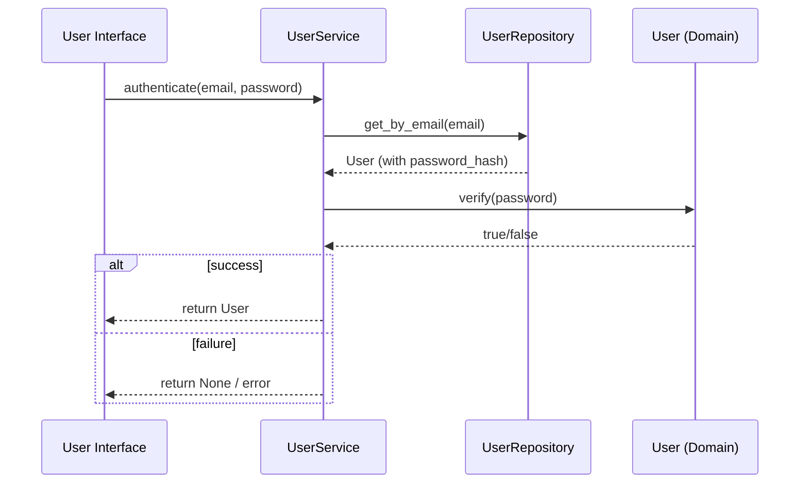
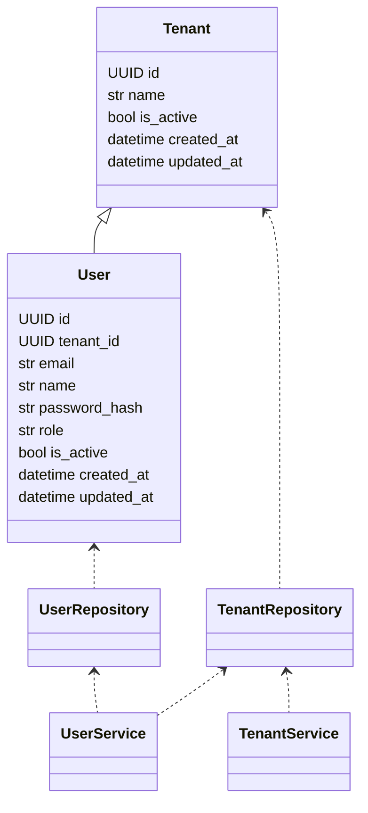

# User and Tenant Domain (DDD)

## Purpose
This document defines the User and Tenant domain for the Portfolio Tracker application, following strict Domain Driven Design (DDD) principles. It describes the domain models, repository layer, and service layer, and how they interact to support multi-tenant, multi-user scenarios.

---

## 1. Domain Model

### Entities
- **Tenant**: Represents an organization or logical grouping of users.
- **User**: Represents an individual with access to the system, belonging to a Tenant.

#### Tenant
- `id: UUID`
- `name: str`
- `is_active: bool`
- `created_at: datetime`
- `updated_at: datetime`


#### User
- `id: UUID`
- `tenant_id: UUID`
- `email: str`
- `name: str`
- `password_hash: str`
- `role: str` (e.g., 'user', 'admin')
- `is_active: bool`
- `created_at: datetime`
- `updated_at: datetime`

---

## Password Hashing (Value Object)

Password security is critical. In strict DDD, password hashes should be encapsulated as a value object (e.g., `PasswordHash`) to enforce invariants and prevent accidental exposure or misuse. The domain model never stores or exposes plaintext passwords.


**Best Practices:**
- Always store only a secure hash of the password, never the plaintext.
- Use a modern, slow hash function (e.g., Argon2, bcrypt, or PBKDF2) with a unique salt per user.
- Use a dedicated library (e.g., `passlib`, `argon2-cffi`, or `bcrypt` in Python). **These libraries automatically generate and store a unique salt for each password hash; you do not need to manage the salt manually. The salt is embedded in the hash string and handled transparently during verification.**
- Validate password strength at the service layer before hashing.
- Never log or return password hashes outside the domain/repository boundary.

**Example (Python, conceptual):**
```python
from passlib.context import CryptContext

pwd_context = CryptContext(schemes=["argon2"], deprecated="auto")

class PasswordHash:
    def __init__(self, hashed: str):
        self.hashed = hashed
    @staticmethod
    def create(plain_password: str) -> "PasswordHash":
        return PasswordHash(pwd_context.hash(plain_password))
    def verify(self, plain_password: str) -> bool:
        return pwd_context.verify(plain_password, self.hashed)
```

**References:**
- [OWASP Password Storage Cheat Sheet](https://cheatsheetseries.owasp.org/cheatsheets/Password_Storage_Cheat_Sheet.html)
- [passlib documentation](https://passlib.readthedocs.io/en/stable/)

---

### Value Objects & Aggregates
- User and Tenant are both aggregate roots.
- Value objects (e.g., Email, PasswordHash) can be introduced for invariants and validation.

---

## 2. Repository Layer

Repositories abstract persistence and provide an interface for working with domain entities.

### Interfaces
```python
class TenantRepository(Protocol):
    def get_by_id(self, tenant_id: UUID) -> Optional[Tenant]: ...
    def get_by_name(self, name: str) -> Optional[Tenant]: ...
    def add(self, tenant: Tenant) -> None: ...
    def list(self) -> List[Tenant]: ...

class UserRepository(Protocol):
    def get_by_id(self, user_id: UUID) -> Optional[User]: ...
    def get_by_email(self, email: str) -> Optional[User]: ...
    def add(self, user: User) -> None: ...
    def list_by_tenant(self, tenant_id: UUID) -> List[User]: ...
```

---

## 3. Service Layer

Services encapsulate business logic and coordinate domain operations.

### Example Services
- **UserService**: Registration, authentication, user management.
- **TenantService**: Tenant creation, activation/deactivation, listing.


#### Example
```python
class UserService:
    def __init__(self, user_repo: UserRepository, tenant_repo: TenantRepository): ...
    def register_user(self, tenant_id: UUID, email: str, name: str, password: str) -> User: ...
    def authenticate(self, email: str, password: str) -> Optional[User]: ...
```

---

## User Login Process (Mermaid Sequence Diagram)

The following diagram illustrates the user login process, showing the interaction between the UI, service, repository, and domain objects:



---

## Login Response: What is Returned to the UI?

On successful authentication, the UI should receive a representation of the authenticated user (excluding sensitive fields) and an authentication token (e.g., JWT or session token). On failure, an error or null/empty response is returned.

**Success Example:**
```json
{
  "user": {
    "id": "uuid",
    "tenant_id": "uuid",
    "email": "user@example.com",
    "name": "Jane Doe",
    "role": "user"
  },
  "token": "jwt-or-session-token"
}
```


**Failure Example:**
```json
{
  "error": "Invalid credentials"
}
```

Sensitive fields like `password_hash` must never be returned. Optionally, tenant info (name, status) can be included if needed for display.

### Creating the JSON Web Token (JWT)

On successful authentication, the service layer generates a JWT (JSON Web Token) to represent the user's session. This token is signed using a server-side secret and encodes claims such as user ID, tenant ID, role, and expiration time. The UI uses this token for subsequent authenticated requests.

**Best Practices:**
- Use a strong, secret signing key (e.g., HS256 or RS256 algorithm).
- Include only non-sensitive claims (e.g., user ID, tenant ID, role, issued/expiry time).
- Set a reasonable expiration (e.g., 15–60 minutes) and support refresh tokens if needed.
- Never store sensitive data (like password hashes) in the token.
- Use a well-maintained library (e.g., `pyjwt` in Python).

**Conceptual Example (Python):**
```python
import jwt
import datetime

def create_jwt(user):
    payload = {
        "sub": str(user.id),
        "tenant_id": str(user.tenant_id),
        "role": user.role,
        "exp": datetime.datetime.utcnow() + datetime.timedelta(minutes=30),
        "iat": datetime.datetime.utcnow(),
    }
    token = jwt.encode(payload, SECRET_KEY, algorithm="HS256")
    return token
```

**References:**
- [JWT Handbook](https://jwt.io/introduction)
- [pyjwt documentation](https://pyjwt.readthedocs.io/en/stable/)

---

## 4. DDD Principles Applied
- **Separation of Concerns**: Domain, repository, and service layers are strictly separated.
- **Dependency Injection**: Services depend on repository interfaces, not implementations.
- **Testability**: Domain logic is isolated from infrastructure, enabling unit testing.
- **Extensibility**: New features (e.g., roles, invitations) can be added without breaking core contracts.

---

## 5. Diagram


---

## 6. References
- [Domain Driven Design Reference](https://domainlanguage.com/ddd/reference/)
- [Repository Pattern](https://martinfowler.com/eaaCatalog/repository.html)
- [Service Layer Pattern](https://martinfowler.com/eaaCatalog/serviceLayer.html)

*Last updated: 2025-06-29*
