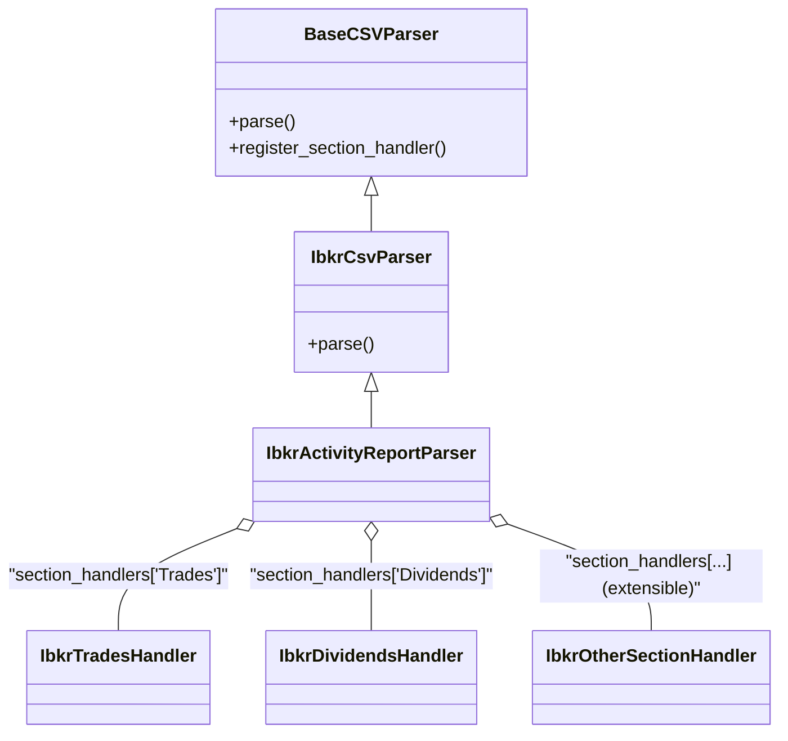

# Interactive Brokers (IBKR) CSV Export Module Design

## Overview
This document outlines the design for a specialized module to parse and process Interactive Brokers (IBKR) CSV exports. The module is extensible and can support multiple IBKR CSV formats. A dedicated subclass, `IbkrActivityReportParser`, is provided for parsing IBKR Activity Report CSVs, with targeted field extraction and normalization.

> **Note:** This document focuses on IBKR-specific logic. For general CSV parsing architecture, handler registration, error handling, and normalization/validation strategies, see the base CSV parsing module documentation.


# Goals
- Accurately parse IBKR activity report CSVs, including all relevant sections (Trades, Dividends, Interest, Fees, etc.)
- Normalize and validate data for downstream portfolio analysis
- Handle multi-section, multi-currency, and multi-account reports
- Integrate with dependency injection and the core CSV parsing module
- Provide strong type checking and error reporting


# Architecture
- `BaseCSVParser` class in `core/csv/base.py`: Provides common CSV parsing interface and utilities.
- `IbkrCsvParser` class in `core/csv/ibkr.py`: Inherits from `BaseCSVParser` and implements IBKR-specific logic.
- Section-specific handlers (e.g., `IbkrTradesHandler`, `IbkrDividendsHandler`)
- Data normalization utilities (e.g., currency conversion, symbol mapping)
- Error and warning reporting for malformed or unexpected data

## Architecture Diagram



# Example Usage
```python
from core.csv.ibkr import IbkrCsvParser, IbkrTradesHandler

# Example section handler for the "Trades" section
class IbkrTradesHandler:
    def __init__(self):
        self.trades = []

    def handle_row(self, row: dict):
        # Example: map and normalize row fields
        trade = {
            'date': row['Date/Time'],
            'symbol': row['Symbol'],
            'quantity': float(row['Quantity']),
            'price': float(row['T. Price']),
            'proceeds': float(row['Proceeds']),
        }
        self.trades.append(trade)

parser = IbkrCsvParser(section_handlers={
    'Trades': IbkrTradesHandler(),
    # Add other handlers as needed
})
activity = parser.parse('ibkr_activity.csv')
# activity.trades, activity.dividends, ...
```

## Key Features
- Section-aware parsing for IBKR's multi-section CSV format
- Typed row mapping for each section (using dataclasses or TypedDict)
- Data normalization (e.g., date/time, currency, symbol)
- Error and warning collection
- Extensible for new IBKR report formats or additional sections
- Inherits from a common `BaseCSVParser` for consistency and code reuse

## Extensibility
- New IBKR sections can be supported by adding new handlers
- Normalization and validation logic can be injected or configured
- Additional CSV parsers for other formats can be created by inheriting from `BaseCSVParser`

For more on handler injection and normalization strategies, see the extensibility and normalization sections of the base CSV parsing module documentation.

## Error Handling
- Detailed error and warning reporting with section and row context
- Optionally support strict and lenient parsing modes

See the base CSV parsing module documentation for configuration details and additional error handling strategies.


## IBKR Activity Report Parsing

The `IbkrActivityReportParser` is designed specifically for the **Interactive Brokers Activity Report** CSV export. It targets the following sections and fields for extraction and normalization:

### Supported Sections and Fields

- **Trades**
  - `date`: Date/Time
  - `symbol`: Symbol
  - `asset_category`: Asset Category
  - `currency`: Currency
  - `quantity`: Quantity
  - `price`: T. Price
  - `proceeds`: Proceeds
  - `commission`: Comm/Fee or Comm in CAD
  - `basis`: Basis
  - `realized_pl`: Realized P/L
  - `mtm_pl`: MTM P/L or MTM in CAD
  - `code`: Code

- **Dividends**
  - `currency`: Currency
  - `date`: Date
  - `description`: Description
  - `amount`: Amount

- **Open Positions**
  - `asset_category`: Asset Category
  - `currency`: Currency
  - `symbol`: Symbol
  - `quantity`: Quantity
  - `cost_price`: Cost Price
  - `cost_basis`: Cost Basis
  - `close_price`: Close Price
  - `value`: Value
  - `unrealized_pl`: Unrealized P/L

- **Other Sections**
  - Mark-to-Market Performance Summary, Account Information, Net Asset Value, Cash Report, Withholding Tax, etc. (fields as present in the report)

### Example Schema (Python TypedDict)

```python
from typing import TypedDict, Optional

class TradeRow(TypedDict):
    date: str
    symbol: str
    asset_category: str
    currency: str
    quantity: float
    price: float
    proceeds: float
    commission: Optional[float]
    basis: Optional[float]
    realized_pl: Optional[float]
    mtm_pl: Optional[float]
    code: Optional[str]

class DividendRow(TypedDict):
    currency: str
    date: str
    description: str
    amount: float
```

> The parser is extensible: you can add handlers for additional sections or fields as needed.

## Testing

For robust testing of the IBKR CSV parsing module, it is recommended to generate and use multiple synthetic test files. These should be stored in a directory such as `tests/test_data/` and may include:

- Minimal valid activity reports (smoke tests)
- Full-featured reports with all possible sections and fields
- Edge cases (missing fields, extra columns, malformed rows)
- Reports with only a subset of sections (e.g., only Trades, only Dividends)
- Reports with unusual or rare data (e.g., multiple currencies, negative values, unknown codes)
- Very large files (for performance/streaming tests)

Name these files descriptively, e.g., `ibkr_activity_minimal.csv`, `ibkr_activity_full.csv`, `ibkr_activity_edgecase.csv`, etc. This approach ensures your tests are organized, maintainable, and provide good coverage for all expected and edge-case scenarios.

---

## Versioning and Format Changes

IBKR may change the structure, field names, or semantics of their CSV exports over time. To ensure long-term maintainability and reliability:

- Track the version or generation date of each IBKR CSV file (if available in the file header or metadata).
- Design your parsers and handlers to be easily extensible for new or legacy formats (e.g., by subclassing, feature flags, or format detection logic).
- When a breaking change is detected, create a new handler or parser version rather than modifying existing logic, to preserve backward compatibility.
- Document supported versions and any known incompatibilities in this file.
- Add tests for new and legacy formats as they are encountered.


## Note on File Size and Streaming

IBKR activity reports are typically not large enough to require file streaming. For most use cases, it is practical and simpler to read the entire file into memory using standard file reading and the `csv` module. If you ever encounter unusually large files, you can revisit streaming, but for the vast majority of reports, this is not necessary.

This approach will help you adapt quickly to changes in IBKR’s export formats and ensure your data pipeline remains robust.

---
Update this document as the IBKR CSV module evolves or as new report formats are encountered.
