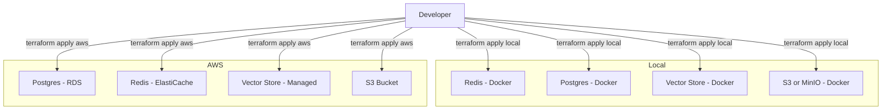

# Infrastructure as Code (IaC) Design Doc

This document outlines the approach for managing local and (optionally) cloud infrastructure for the portfolio tracker project using Infrastructure as Code (IaC). The primary tool under consideration is Terraform, but alternatives are briefly discussed.

## Goals
- Reproducible, version-controlled infrastructure
- Easy local development setup (e.g., Docker containers for Redis, Postgres, vector store)
- Extensible to cloud environments if needed
- Minimal manual steps for onboarding and updates

## Options Considered

### 1. **Terraform (Recommended)**
- **Pros:**
  - Industry standard, widely supported
  - Works with local and cloud providers
  - Rich module ecosystem (Docker, AWS, GCP, Azure, etc.)
  - Declarative, stateful
- **Cons:**
  - Requires learning HCL (HashiCorp Configuration Language)
  - State management can be tricky for teams (but manageable for local/dev)

### 2. **Docker Compose**
- **Pros:**
  - Simple for local Docker-based setups
  - Easy to read and use
- **Cons:**
  - Not as extensible to cloud or non-Docker resources
  - No built-in state management or advanced provisioning

### 3. **Pulumi**
- **Pros:**
  - Uses familiar programming languages (Python, TypeScript, etc.)
  - Good for complex logic
- **Cons:**
  - Smaller ecosystem than Terraform
  - Less standard in ops teams

**We are leaning towards Terraform for its flexibility, ecosystem, and ability to manage both local and cloud resources.**

## Proposed Local Infrastructure (Initial)
- **Redis** (for caching, pub/sub, etc.)
- **Postgres** (for persistent storage)
- **Vector Store** (e.g., Qdrant, Milvus, or Weaviate, for LLM/embedding use cases)
- **(Optional) MinIO or S3-compatible storage**

## Example Terraform Structure




## Example Terraform Directory Layout

```
infrastructure/
  environments/
    local/
      main.tf
      variables.tf
      outputs.tf
    aws/
      main.tf
      variables.tf
      outputs.tf
  modules/
    redis/
      main.tf
      variables.tf
      outputs.tf
    postgres/
      main.tf
      variables.tf
      outputs.tf
    vectorstore/
      main.tf
      variables.tf
      outputs.tf
    # ...other reusable modules...
  README.md
```

## Example: Docker Provider in Terraform

```hcl
provider "docker" {}

resource "docker_image" "redis" {
  name = "redis:7"
}

resource "docker_container" "redis" {
  name  = "redis"
  image = docker_image.redis.latest
  ports {
    internal = 6379
    external = 6379
  }
}
```

## Environment Selection: Local vs AWS


**State Management Note:**
Always use separate Terraform state files for local and AWS environments. Each environment directory (e.g., `environments/local/`, `environments/aws/`) should have its own `.terraform/` and `terraform.tfstate` files. Sharing a state file between local and cloud can cause resource conflicts, accidental deletions, or unwanted changes. Keeping state separate ensures safe, independent management of each environment.

You cannot use a single Terraform resource block for both local (Docker) and AWS (RDS) Postgres, as they are different resource types and providers. However, you can structure your Terraform code to select which environment to deploy by:

### 1. Separate Environments/Directories (Recommended)
- `infrastructure/environments/local/` contains Docker resources.
- `infrastructure/environments/aws/` contains AWS resources.
- You run `terraform apply` in the directory for the environment you want.

### 2. Modules with Conditional Logic (Advanced)
You can use a variable (e.g., `environment = "local" | "aws"`) and conditionally include modules/resources, but you still need to define both resource types, and only one will be created based on the variable.

Example:
```hcl
variable "environment" { default = "local" }

module "postgres_local" {
  source = "../modules/postgres/local"
  enabled = var.environment == "local"
  # ...other vars...
}

module "postgres_aws" {
  source = "../modules/postgres/aws"
  enabled = var.environment == "aws"
  # ...other vars...
}
```

### 3. Workspaces (for state separation)
Terraform workspaces can help keep state separate for local and AWS, but you still need to structure your code to only create the right resources for each environment.

**Summary:**
- You can't use a single resource block for both local and AWS Postgres.
- You can use separate directories, modules, or conditional logic to select which resources to create.
- Only the resources for the selected environment will be created/applied.

This approach is common in IaC: you define all possible resources, but only the relevant ones are created based on your environment selection.

## Next Steps
- Start with a minimal `infrastructure/` directory using Terraform and the Docker provider
- Add modules/resources for Redis, Postgres, and a vector store
- Document usage: `terraform init`, `terraform apply`, and teardown
- Optionally, add cloud modules for future migration

---
Update this document as infrastructure needs evolve or new services are added.
