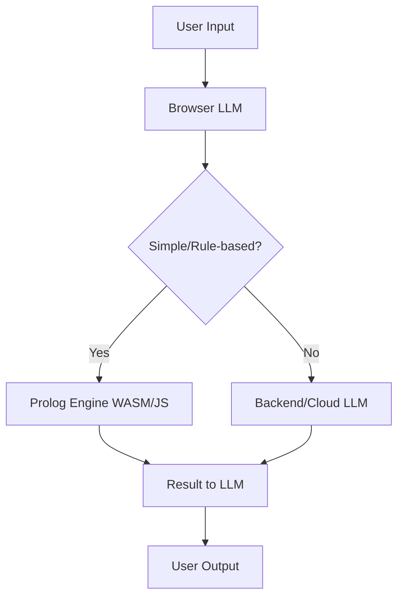

# LLM-First Architecture for Portfolio Tracker

This document describes an LLM-first architecture for the Portfolio Tracker project, where a browser-based LLM acts as the primary interface for intent recognition, orchestration, and hybrid reasoning.

---

## 1. Overview

- The browser runs a small/efficient LLM (e.g., via WebLLM, WebAI, or Transformers.js).
- The LLM interprets user input, recognizes intent, and determines the next action (fetch data, generate a chart, escalate to cloud, etc.).
- Simple Q&A, summarization, and local data processing can be handled entirely in the browser.
- For complex tasks, the browser LLM launches requests to the backend or cloud LLMs.
- Optionally, a Prolog rule engine (compiled to WASM or JS) runs in the browser for deterministic logic and rule-based checks.

---

## 2. Key Components

### a. Browser LLM
- Handles natural language understanding, intent recognition, and simple processing.
- Can pre-process, summarize, or route requests.

### b. Prolog Rule Engine (Optional)
- Runs in-browser (e.g., Tau Prolog, SWI-Prolog WASM).
- Used for deterministic, auditable logic (e.g., compliance checks, rule validation).
- LLM can generate or query rules as needed.

### c. Backend/Cloud LLM
- Handles advanced reasoning, large context, or heavy computation.
- Receives escalated requests from the browser LLM.

---

## 3. Example Workflow

1. User types: "Show me all trades that violate my risk rules."
2. Browser LLM recognizes intent: "risk rule check."
3. LLM queries the Prolog engine in-browser with current data and rules.
4. Prolog returns violations.
5. LLM summarizes and presents results, or escalates to backend/cloud if needed.

---

## 4. Benefits

- **Privacy:** User data and rules can stay local for many tasks.
- **Responsiveness:** Instant feedback for simple and rule-based queries.
- **Hybrid Reasoning:** Combine LLM's flexibility with Prolog's strict logic.
- **Extensibility:** Add new rules or logic without backend changes.
- **Cost Efficiency:** Reduces cloud API usage by handling routine tasks locally.

---

## 4a. Client-Side Rules and Strong Rate Limiting

- **Client-Side Rules:**
  - The browser can enforce business logic, compliance, or usage rules before any request is sent to the backend or cloud.
  - Prolog or other rule engines can be used to validate requests, check permissions, or block unsafe actions locally.
  - This reduces unnecessary backend load and increases user privacy.

- **Strong Rate Limiting:**
  - Implement rate limiting directly in the client (browser) to prevent abuse or excessive requests to backend/cloud LLMs.
  - Rate limits can be based on time windows (e.g., max N requests per minute/hour) or on request complexity.
  - The LLM or rule engine can warn users or require confirmation before sending expensive or frequent requests.
  - Client-side rate limiting complements any server-side protections, providing a first line of defense and better user feedback.

---

## 5. Example Architecture Diagram

---

## 6. Technologies

- **Browser LLM:** WebLLM, WebAI, Transformers.js
- **Prolog Engine:** Tau Prolog (JS), SWI-Prolog (WASM)
- **Backend LLM:** OpenAI, Gemini, or self-hosted models

---

## 7. References

- [WebLLM (MLC)](https://mlc.ai/web-llm/)
- [Google WebAI](https://ai.google.dev/gemini-api/docs/webai)
- [Tau Prolog](https://github.com/tau-prolog/tau-prolog)
- [SWI-Prolog WASM](https://github.com/SWI-Prolog/swipl-wasm)
- [Transformers.js](https://xenova.github.io/transformers.js/)

---
