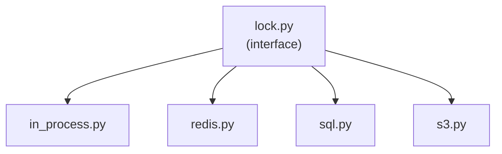

# Lock Module Design

This document describes the design and extensibility of the generic lock module for the portfolio tracker application.

## Overview
The lock module provides a unified interface for acquiring and releasing locks, supporting multiple backends:
- **In-process (thread/process)** (implemented)
- Redis *(planned)*
- SQL (e.g., PostgreSQL advisory locks) *(planned)*
- S3 (object-based locking) *(planned)*

Currently, only the in-process lock is implemented. Other backends are planned for future development.

This enables safe coordination of resources across different deployment scenarios.

## Architecture



## Description
- **lock/**: Lock module package
  - `lock.py`: Defines the generic lock interface/base class
  - `in_process.py`: Named in-process/thread lock implementation using a shared registry
  - `redis.py`: Redis-based distributed lock
  - `sql.py`: SQL-based lock (e.g., PostgreSQL advisory lock)
  - `s3.py`: S3 object-based lock

## Extensibility
- Add new backends by implementing the lock interface
- Register new lock types in the DI container for easy swapping

## Example Usage
```python
from core.lock.in_process import InProcessLock
lock1 = InProcessLock("resource_name")
lock2 = InProcessLock("resource_name")
# lock1 and lock2 share the same underlying lock object
with lock1:
    # critical section
    ...
```

---
Update this document as new lock backends or features are added.
