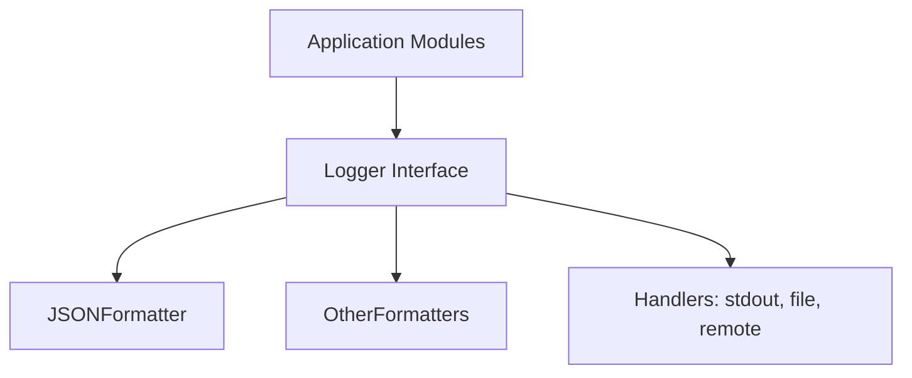

# Logger Module Design

This document outlines the design for a structured logger module for the portfolio tracker project. The logger will support multiple log levels and output logs in a structured format (e.g., JSON) for easy parsing, searching, and integration with log management systems.

## Goals
- Provide a unified, structured logging interface for all modules
- Support multiple log levels (DEBUG, INFO, WARNING, ERROR, CRITICAL)
- Output logs in a structured format (JSON by default, extensible to others)
- Allow for easy integration with external log management and observability tools
- Support contextual and extra fields (e.g., request_id, user_id, module, etc.)
- Pluggable backends/handlers (stdout, file, remote, etc.)

## Architecture Overview



## Interface

The logger module will define a `Logger` class with the following methods:

```python
class Logger:
    def debug(self, msg: str, **kwargs): ...
    def info(self, msg: str, **kwargs): ...
    def warning(self, msg: str, **kwargs): ...
    def error(self, msg: str, **kwargs): ...
    def critical(self, msg: str, **kwargs): ...
```
- Each method logs a message at the corresponding level.
- Additional context can be passed as keyword arguments and will be included in the structured output.

## Structured Output Example

```json
{
  "timestamp": "2025-06-27T12:34:56.789Z",
  "level": "INFO",
  "message": "User login successful",
  "user_id": 123,
  "module": "auth",
  "extra": {"ip": "1.2.3.4"}
}
```

## JSONFormatter
- Formats log records as JSON objects
- Includes timestamp, level, message, and all extra fields
- Extensible for custom fields

## Handlers
- StdoutHandler: writes logs to stdout (default)
- FileHandler: writes logs to a file
- (Future) RemoteHandler: sends logs to a remote endpoint
- Handlers can be composed or swapped as needed

## Usage Example

```python
from core.logger import Logger
logger = Logger()
logger.info("Stock price fetched", symbol="AAPL", price=123.45)
```

## Future Extensions
- Add support for async logging
- Add support for log rotation, batching, and remote delivery
- Add integration with OpenTelemetry or other observability tools
- Add filtering and sampling

---
Update this document as the logger module evolves or new handlers/formatters are added.
