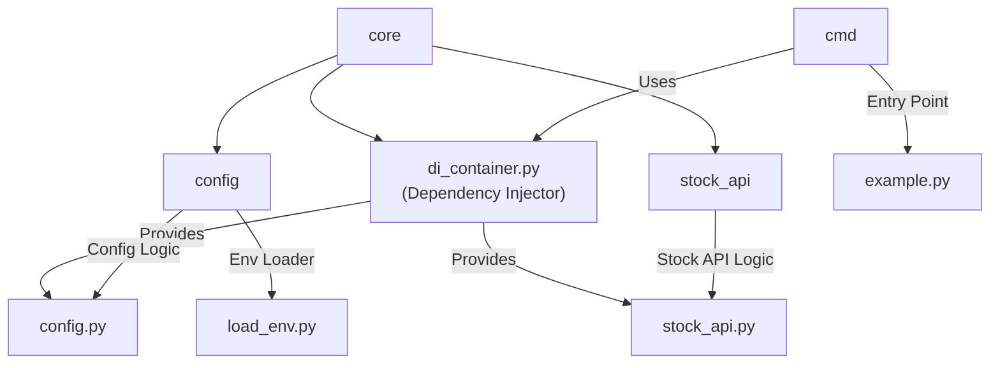

# Module Architecture

This document outlines the planned architecture for the project modules and their relationships.

## Folder Structure

## Description

- **core/**: Main source folder for core modules.
  - **config/**: Configuration and environment loading logic.
    - `config.py`: Centralized config access and validation.
    - `load_env.py`: Loads environment variables from `.env` files.
  - **stock_api/**: Stock price and data fetching logic.
    - `stock_api.py`: Handles API integration for stock data.
  - `di_container.py`: Dependency injection container using `dependency-injector` to wire and provide dependencies.
- **cmd/**: Command-line entry points and scripts.
  - `example.py`: Example entry point for running the application, retrieves dependencies from the DI container.

---
**Dependency Injection**

The project uses the [`dependency-injector`](https://python-dependency-injector.ets-labs.org/) package to manage and inject dependencies. The DI container (`di_container.py`) wires together configuration, API modules, and other services, making the codebase more modular and testable.

---
Update this document as the architecture evolves. Use Mermaid diagrams for visual clarity.
