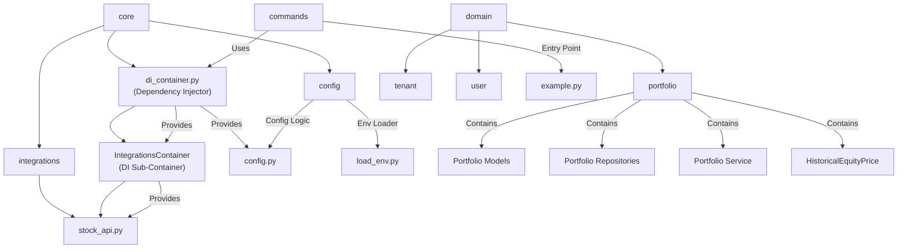

# Module Architecture

This document outlines the planned architecture for the project modules and their relationships.

## Folder Structure

## Description

- **core/**: Main source folder for core modules.
  - **config/**: Configuration and environment loading logic.
    - `config.py`: Centralized config access and validation.
    - `load_env.py`: Loads environment variables from `.env` files.
  - **integrations/**: Integrations with external services.
    - `stock_api.py`: Handles API integration for stock data.
  - `di_container.py`: Dependency injection container using `dependency-injector` to wire and provide dependencies, including an `IntegrationsContainer` sub-container for integrations like `stock_api`.

- **domain/**: Domain layer following DDD principles.
  - **portfolio/**: Portfolio bounded context.
    - **models/**: Domain models (Portfolio, EquityHolding, CashHolding, ActivityReportEntry, HistoricalEquityPrice).
    - **repository/**: Repository interfaces and implementations.
    - **portfolio_service.py**: Application service layer for portfolio operations.
    - **portfolio_events.py**: Domain events for portfolio operations.
  - **tenant/**: Tenant management bounded context.
  - **user/**: User management bounded context.

- **commands/**: Command-line entry points and scripts.
  - `example.py`: Example entry point for running the application, retrieves dependencies from the DI container.

---
**Dependency Injection**

The project uses the [`dependency-injector`](https://python-dependency-injector.ets-labs.org/) package to manage and inject dependencies. The DI container (`di_container.py`) wires together configuration, API modules, and other services, making the codebase more modular and testable.

---
**Domain-Driven Design**

The domain layer follows strict DDD principles:

- **Bounded Contexts**: Separate contexts for portfolio, tenant, and user domains
- **Aggregates**: Portfolio serves as the aggregate root for holdings and activity entries
- **Domain Services**: PortfolioService provides application-layer coordination
- **Repository Pattern**: Abstract data access behind repository interfaces
- **Domain Events**: Capture significant business events for integration and audit

---
Update this document as the architecture evolves. Use Mermaid diagrams for visual clarity.
