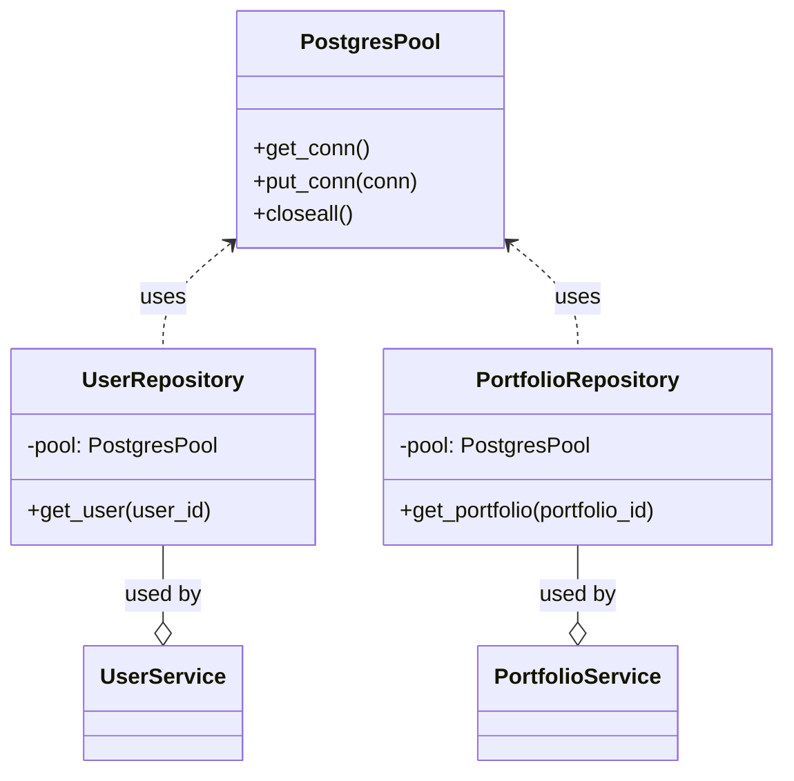
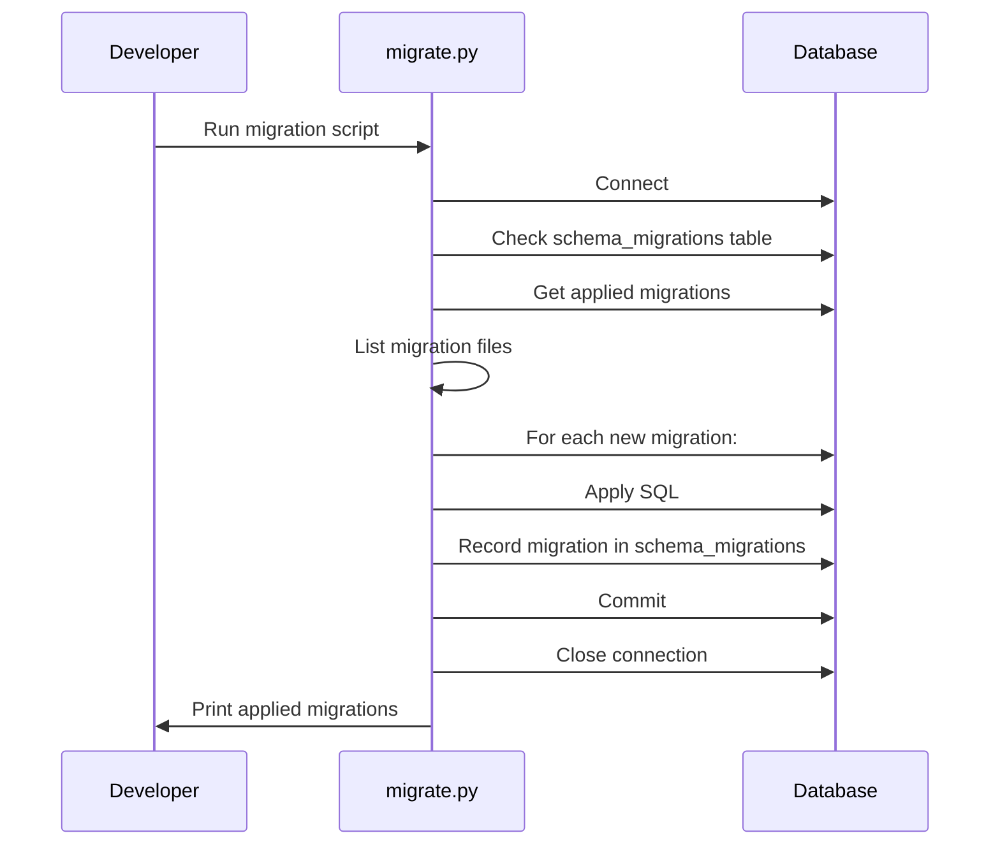
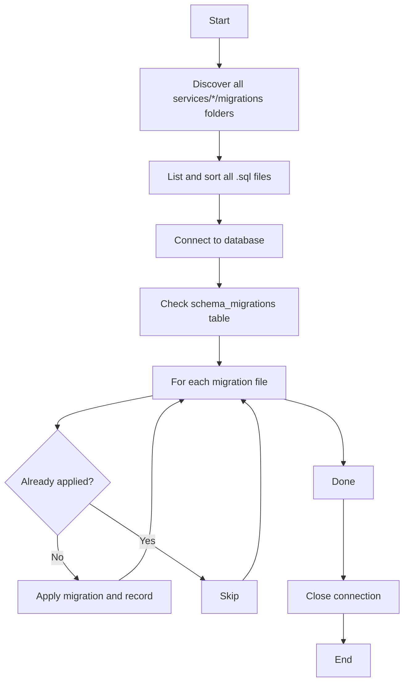

# Persistence, Repository, and Migration Design Doc

## Overview
This document describes the architecture for data persistence, repository pattern, and database migrations for the portfolio tracker project. The goal is to provide a modular, extensible, and testable approach to data access and schema management, supporting multiple backends (e.g., Postgres, DynamoDB) and robust migration workflows.

---


## Diagrams


### Persistence & Repository Relationship


### Migration Process Sequence


## 1. Persistence Module

### Purpose
- Centralizes management of raw database connections/clients (e.g., Postgres, DynamoDB, SQLite).
- Handles connection pooling, configuration, and lifecycle.
- Exposes a simple interface for repositories to acquire connections.

### Structure
```
core/persistence/
  __init__.py
  postgres.py      # Postgres connection pool/client
  dynamodb.py      # DynamoDB client (optional)
  ...
```

## Deadline Enforcement (Query Timeouts)

To ensure that database queries do not exceed a specified time limit, the project provides a general-purpose `DeadlineManager` utility in `core/deadline_manager.py`. This can be used to enforce deadlines (timeouts) for any resource, including database queries.

- `DeadlineManager(timeout_seconds)` starts a timer and raises `DeadlineExceeded` if the deadline is exceeded.
- The `CursorWithDeadline` wrapper (see `core/persistence/postgres.py`) checks the deadline before each query execution.
- This pattern is useful for preventing long-running queries from blocking application resources.

**Example Usage:**
```python
from core.persistence.postgres import PostgresPool, CursorWithDeadline
from core.deadline_manager import DeadlineManager, DeadlineExceeded

pool = PostgresPool()
deadline = DeadlineManager(timeout_seconds=2)

try:
    with pool.connection(deadline) as (conn, deadline_mgr):
        with conn.cursor() as raw_cursor:
            cursor = CursorWithDeadline(raw_cursor, deadline_mgr)
            cursor.execute("SELECT 1;")
            result = cursor.fetchone()
            print(result)
except DeadlineExceeded:
    print("Query exceeded the deadline!")
finally:
    pool.closeall()
```

See also: `core/deadline_manager.py` for implementation details.


### Example (Postgres)
```python
# core/persistence/postgres.py
import psycopg2
from psycopg2.pool import SimpleConnectionPool
from core.config.config import get_postgres_config

class PostgresPool:
    def __init__(self):
        cfg = get_postgres_config()
        self.pool = SimpleConnectionPool(
            minconn=1,
            maxconn=10,
            user=cfg.user,
            password=cfg.password,
            host=cfg.host,
            port=cfg.port,
            database=cfg.db,
        )
    def get_conn(self):
        return self.pool.getconn()
    def put_conn(self, conn):
        self.pool.putconn(conn)
    def closeall(self):
        self.pool.closeall()
```

---


## 2. Service (Feature) Modules & Repositories

### Purpose
- Encapsulate all data access logic and business logic for a domain/entity (e.g., User, Portfolio).
- Use the persistence module for connections.
- Contain CRUD/query methods and business-specific data logic.
- Each service module can have its own repository and migration scripts.

### Structure
```
services/
  user/
    repository.py
    migrations/
  portfolio/
    repository.py
    migrations/
```

### Example
```python
# services/user/repository.py
from core.persistence.postgres import PostgresPool

class UserRepository:
    def __init__(self, pool: PostgresPool):
        self.pool = pool
    def get_user(self, user_id):
        conn = self.pool.get_conn()
        try:
            with conn.cursor() as cur:
                cur.execute("SELECT * FROM users WHERE id=%s", (user_id,))
                return cur.fetchone()
        finally:
            self.pool.put_conn(conn)
```

---

## 3. Migrations (Modular)

### Purpose
- Manage schema changes in a versioned, repeatable way.
- Support upgrades, rollbacks, and team collaboration.
- Each service module manages its own migrations in `services/<module>/migrations/`.

### Structure
```
services/
  user/
    migrations/
      001_create_users.sql
      ...
  portfolio/
    migrations/
      001_create_portfolio_table.sql
      ...
core/
  migrations/
    migrate.py  # Migration runner script (discovers and runs all service migrations)
```

### Migration Tooling
- **Recommended:** Use a Python-native migration tool such as [Alembic](https://alembic.sqlalchemy.org/) (for SQLAlchemy/Postgres) or [yoyo-migrations](https://ollycope.com/software/yoyo/latest/).
- Alternatively, implement a migration runner (e.g., `core/migrations/migrate.py`) that recursively finds and applies raw SQL files in all `services/*/migrations/` folders in order.

---

## 4. Migration Runner

The migration runner is responsible for discovering and applying all new migrations in every `services/*/migrations/` folder, in order. It ensures each migration is only applied once, and records applied migrations in a `schema_migrations` table.

### Migration Runner Diagram


### Migration Runner Example (Python)
```python
# core/migrations/migrate.py
import os, psycopg2, glob
from core.config.config import get_postgres_config

def run_migrations():
    cfg = get_postgres_config()
    conn = psycopg2.connect(
        user=cfg.user, password=cfg.password, host=cfg.host, port=cfg.port, database=cfg.db
    )
    cur = conn.cursor()
    applied = set()
    cur.execute("CREATE TABLE IF NOT EXISTS schema_migrations (filename TEXT PRIMARY KEY)")
    cur.execute("SELECT filename FROM schema_migrations")
    for row in cur.fetchall():
        applied.add(row[0])
    # Find all migrations in all services/*/migrations/
    migration_files = []
    for path in glob.glob("services/*/migrations/*.sql"):
        migration_files.append(path)
    for fname in sorted(migration_files):
        if fname not in applied:
            with open(fname) as f:
                sql = f.read()
                cur.execute(sql)
                cur.execute("INSERT INTO schema_migrations (filename) VALUES (%s)", (fname,))
                print(f"Applied {fname}")
    conn.commit()
    cur.close()
    conn.close()

if __name__ == "__main__":
    run_migrations()
```

---


## 5. Running Migrations

### Option 1: Python Script (Recommended)
- Run all service/module migrations with:
  ```sh
  python core/migrations/migrate.py
  ```
- This script will discover and apply all new migrations in every `services/*/migrations/` folder, in order.


### Option 2: CLI Tool (Optional)
- You may add a CLI (e.g., using [Typer](https://typer.tiangolo.com/) or [Click](https://click.palletsprojects.com/)) for commands like:
  ```sh
  python manage.py migrate
  python manage.py makemigration
  python manage.py rollback
  ```
- **Note:** `manage.py` is not present by default. If you wish to add CLI support, create a `manage.py` at the project root. For example:
  ```python
  # manage.py (stub example)
  import typer
  app = typer.Typer()

  @app.command()
  def migrate():
      from core.migrations.migrate import run_migrations
      run_migrations()

  if __name__ == "__main__":
      app()
  ```
- This can be extended to support multiple backends, environments, or advanced migration workflows.

### Option 3: Task Runner (Optional)
- Integrate with a Python task runner (e.g., [Invoke](https://www.pyinvoke.org/), [Poetry scripts](https://python-poetry.org/docs/scripts/), or Makefile) for developer convenience.

---

## 6. Summary
- **Persistence module:** Handles raw DB connections/clients.
- **Repositories:** Encapsulate data access and business logic per domain.
- **Migrations:** Versioned, repeatable schema changes, runnable via script or CLI.
- **Extensible:** Easy to add new backends, repositories, or migration tools.

---


### Example Structure (Updated)
```
services/
  user/
    repository.py
    migrations/
  portfolio/
    repository.py
    migrations/
core/
  persistence/
  cache/
  migrations/
    migrate.py
  ...
```

_Update this document as the persistence and migration needs evolve._
