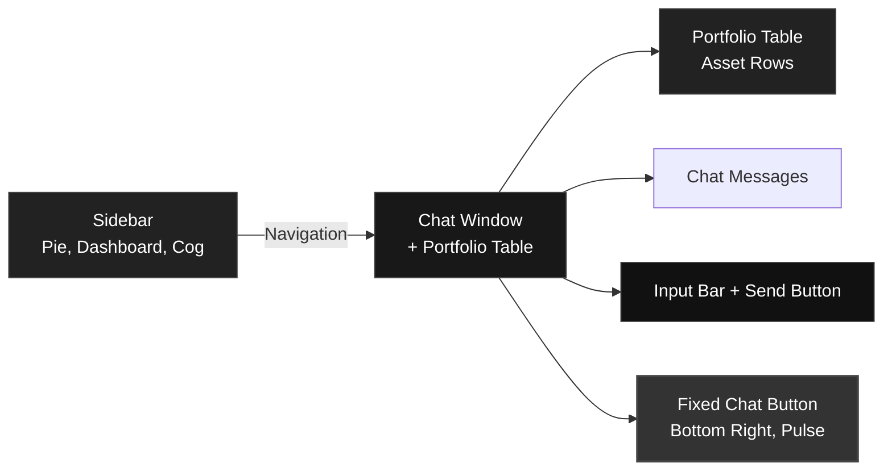

# UI Design Document: Portfolio Tracker Chat & Dashboard

## Overview
This document describes the user interface design for the Portfolio Tracker application, focusing on a modern, minimal, and dark-themed experience. The design centers around a full-screen chat window, a slim sidebar for navigation, and a portfolio dashboard with analytics and settings.

---

## Layout Structure

- **Full-Screen Chat Window**
  - Occupies 80% of the screen width (right side).
  - Sleek input bar fixed at the bottom, spanning the chat area width.
  - Send button features a paper plane icon with a leftward hover animation.
  - Chat messages fill the main area, with a circular, subtle pulse indicator for new messages.
  - Chat panel slides up from the bottom when the fixed chat button (bottom right) is clicked.
  - Minimal, dark mode styling throughout.

- **Left Sidebar (Navigation)**
  - Slim vertical bar (fixed width, ~60px).
  - Contains three vertically stacked icons:
    1. Portfolio (pie chart icon)
    2. Analytics (dashboard icon)
    3. Settings (cog icon)
  - Sidebar always visible for quick navigation.

- **Portfolio Screen**
  - Main content area when "Portfolio" is selected.
  - Table view with asset rows.
  - Columns: Asset Name, Value, Percentage Change.
  - Clean, minimal table design with dark mode colors.

- **Fixed Chat Button**
  - Circular button in the bottom right corner of the screen.
  - Subtle pulse animation when new messages arrive.
  - Clicking slides up the chat panel.

---

## User Flows

1. **Chat Interaction**
   - User clicks the chat button (bottom right).
   - Chat panel slides up, covering 80% of the screen.
   - User types in the input bar; send button animates on hover.
   - New messages trigger a pulse on the chat button if the panel is closed.

2. **Navigation**
   - User clicks sidebar icons to switch between Portfolio, Analytics, and Settings.
   - Active icon is highlighted.

3. **Portfolio Table**
   - User views a table of assets with real-time value and percentage change.
   - Table is responsive and minimal.

---

## Visual Design

- **Dark Mode**: All backgrounds, text, and UI elements use a dark color palette with high-contrast accents.
- **Minimalism**: No unnecessary borders or shadows; focus on whitespace and clarity.
- **Animations**: Subtle transitions for chat panel, button hover, and pulse effects.
- **Icons**: Use modern, line-style icons for sidebar and chat send button.

---

## Wireframes

### Text-Based Wireframe

```
+---------------------------------------------------------------+
|  | Portfolio | Analytics | Settings |                         |
|  |   (Pie)   | (Dashbd)  |  (Cog)   |      Chat/Portfolio    |
|  |-----------|-----------|----------|------------------------|
|  |                                           +------------+  |
|  |                                           |            |  |
|  |                                           |  Chat      |  |
|  |                                           |  Window    |  |
|  |                                           |            |  |
|  |                                           +------------+  |
|  |                                                        |  |
|  |   Portfolio Table:                                     |  |
|  |   +--------+--------+----------------+                 |  |
|  |   | Name   | Value  | % Change       |                 |  |
|  |   +--------+--------+----------------+                 |  |
|  |   | ...    | ...    | ...            |                 |  |
|  |   +--------+--------+----------------+                 |  |
|  |                                                        |  |
|  |   [Input Bar____________________][Send >]              |  |
|  |                                                        |  |
|  |                                   (Chat Button)        |  |
|  |                                   (Bottom Right, Pulse)|  |
+-----------------------------------------------------------+
```

### Enhanced Mermaid Wireframe



---

## Component List

- Sidebar (with icons)
- Chat panel (sliding, full-screen)
- Input bar (with animated send button)
- Portfolio table (asset rows, value, % change)
- Fixed chat button (with pulse)
- Pulse indicator for new messages
- Dark mode theme

---

## Accessibility & Responsiveness
- All components are keyboard accessible.
- Responsive layout for desktop and tablet.
- Sufficient color contrast for dark mode.

---

## Future Extensions
- Analytics dashboard with charts.
- Settings panel for user preferences.
- Mobile layout (future version).

---

_Update this document as the UI evolves or new features are added._
